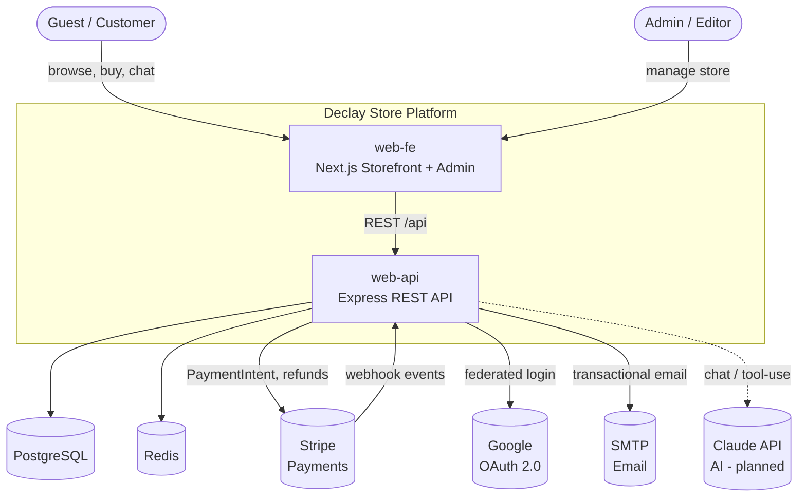
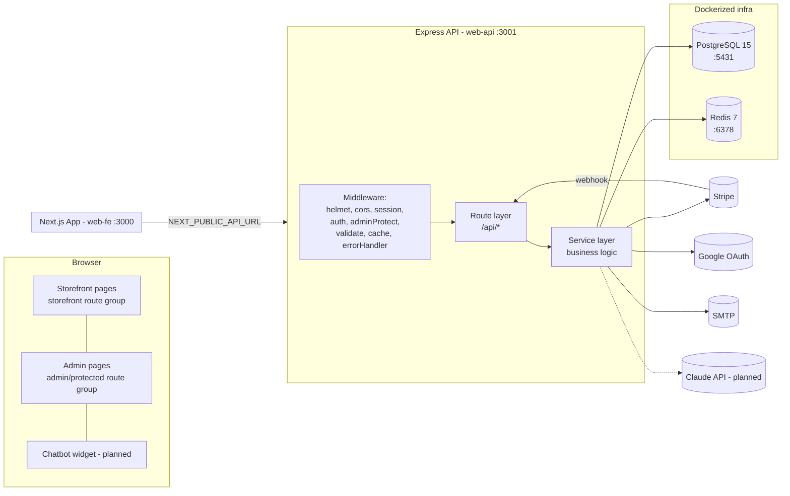
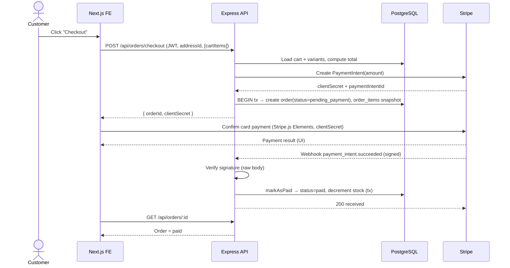
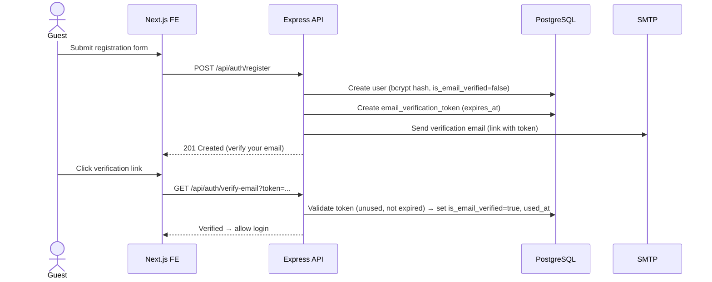
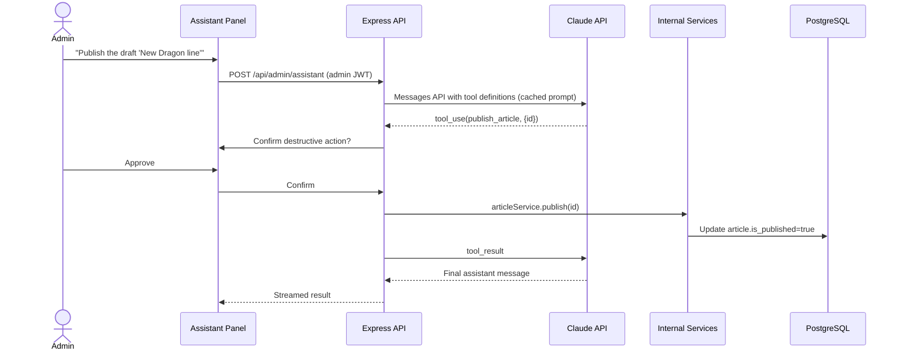
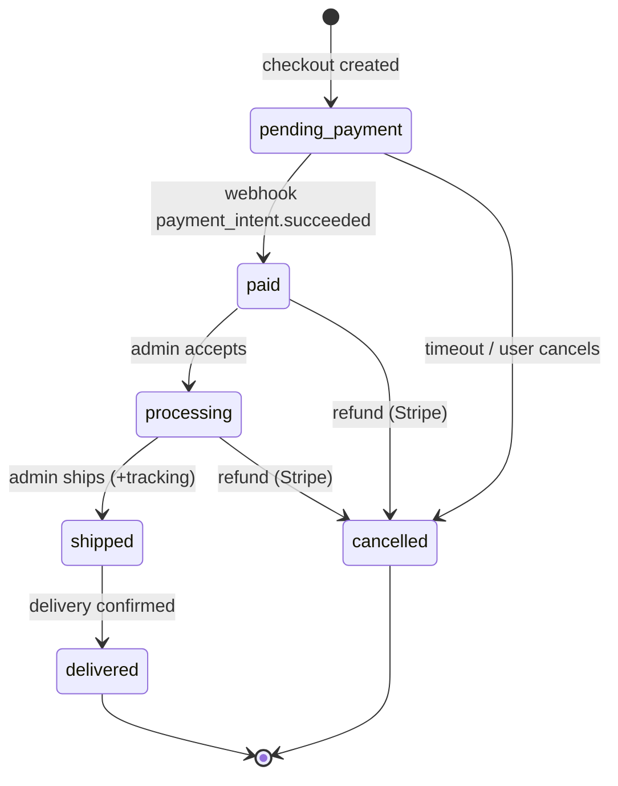
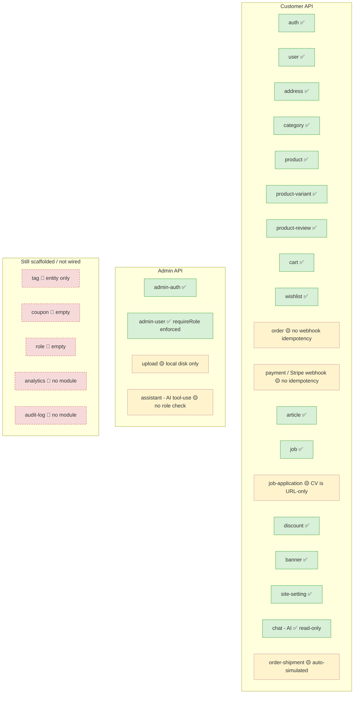

# Declay Store — Diagrams

**Companion to:** `01-requirements-brd-srs.md`, `03-system-design.md`
**Date:** 2026-06-19 (original) · **Re-audited 2026-07-07**
**Notation:** Mermaid (renders in GitHub, VS Code with Mermaid preview, and most Markdown viewers)

> **2026-07-07 re-audit:** diagrams 8 and 9 (AI chatbot / AI assistant) were drawn as *planned* sequences on 2026-06-19; both are now **built** and match these sequences closely, with one addition — the assistant flow now includes a Redis-backed pending-confirmation state (10-min TTL) for destructive tool calls. Diagram 11 (module map) is now almost entirely "solid" — see the updated version below. A new sequence not covered here has also been added to the codebase: an automated BullMQ fulfillment pipeline that advances `paid → processing → shipped → delivered` on a timer with a simulated carrier/tracking number (no admin step) — see `03-system-design.md` §6.5 for a full description and the open business-rule question it raises.

Contents:
1. System context (C4 level 1)
2. Container / deployment architecture
3. Use case diagram
4. Entity-Relationship diagram (data model)
5. Sequence — Customer checkout & payment
6. Sequence — Customer registration & email verification
7. Sequence — Admin order fulfillment
8. Sequence — Storefront AI chatbot (planned)
9. Sequence — Admin AI assistant with tool-use (planned)
10. Order status state machine
11. Module / component map (backend)

---

## 1. System Context (C4 — Level 1)



---

## 2. Container / Deployment Architecture



---

## 3. Use Case Diagram

```mermaid
graph TB
    guest([Guest])
    customer([Customer])
    editor([Editor])
    admin([Admin])
    superadmin([Super Admin])
    chatbot([Storefront Chatbot])
    assistant([Admin AI Assistant])

    subgraph Storefront
        uc1[Browse & search catalogue]
        uc2[View product & variants]
        uc3[Register / Login / Google OAuth]
        uc4[Manage profile & addresses]
        uc5[Manage cart]
        uc6[Manage wishlist]
        uc7[Checkout & pay - Stripe]
        uc8[View & track orders]
        uc9[Cancel order / refund]
        uc10[Write product review]
        uc11[Read blog]
        uc12[View & apply to jobs]
        uc13[Ask chatbot - read only]
    end

    subgraph Admin
        uc20[Manage categories]
        uc21[Manage products & variants]
        uc22[Manage orders & status]
        uc23[View shipments - auto-simulated, not admin-entered]
        uc24[Manage discount codes]
        uc25[Manage articles / blog]
        uc26[Manage banners]
        uc27[Manage jobs & applications]
        uc28[Moderate reviews]
        uc29[View sales analytics - dashboard shell, no API]
        uc30[Manage admin users - super_admin only, enforced]
        uc31[Manage site settings - not role-restricted]
        uc32[Use AI assistant - tool-use, not role-restricted]
    end

    guest --> uc1 & uc2 & uc3 & uc11 & uc12 & uc13
    customer --> uc4 & uc5 & uc6 & uc7 & uc8 & uc9 & uc10
    customer --> uc1 & uc2 & uc11 & uc12 & uc13
    editor --> uc25 & uc26 & uc28
    admin --> uc20 & uc21 & uc22 & uc23 & uc24 & uc27 & uc28 & uc29 & uc32
    admin --> uc25 & uc26
    superadmin --> uc30 & uc31
    uc13 -.serves.-> chatbot
    uc32 -.serves.-> assistant
```



---

## 4. Entity-Relationship Diagram (Data Model)

> Reflects migrations `001`–`003`. Key rule: **price and stock live on `product_variants`, never on `products`.**

```mermaid
erDiagram
    users ||--o{ addresses : has
    users ||--o| carts : owns
    users ||--o| wishlists : owns
    users ||--o{ orders : places
    users ||--o{ product_reviews : writes
    users ||--o{ email_verification_tokens : has
    users ||--o{ password_reset_tokens : has

    admin_users ||--o{ articles : authors
    admin_users ||--o{ banners : creates

    categories ||--o{ categories : parent_of
    categories ||--o{ products : contains
    products ||--o{ product_variants : has
    products ||--o{ product_reviews : receives
    products }o--o{ tags : tagged
    articles }o--o{ tags : tagged

    carts ||--o{ cart_items : contains
    product_variants ||--o{ cart_items : in
    wishlists ||--o{ wishlist_items : contains
    product_variants ||--o{ wishlist_items : in

    orders ||--o{ order_items : contains
    product_variants ||--o{ order_items : referenced_by
    orders ||--o| order_shipments : has
    orders }o--o| addresses : ships_to
    discount_codes ||--o{ orders : applied_to

    chat_sessions ||--o{ chat_messages : contains
    users ||--o{ chat_sessions : starts
    admin_users ||--o{ chat_sessions : starts

    jobs ||--o{ job_applications : receives

    users {
        int id PK
        string email UK
        string username UK
        string password "nullable for OAuth"
        string google_id UK
        string auth_provider
        bool is_email_verified
    }
    admin_users {
        int id PK
        string email UK
        string password
        enum role "super_admin|admin|editor"
    }
    categories {
        int id PK
        string slug UK
        int parent_id FK "self"
    }
    products {
        int id PK
        int category_id FK
        string slug UK
    }
    product_variants {
        int id PK
        int product_id FK
        numeric price
        int stock
        text_array images
    }
    orders {
        int id PK
        int user_id FK
        enum status
        numeric total_amount
        string stripe_payment_intent_id UK
        int shipping_address_id FK
        int discount_code_id FK
        numeric discount_amount
    }
    order_items {
        int id PK
        int order_id FK
        int variant_id FK
        int quantity
        numeric price_at_purchase
        string variant_name_at_purchase
        string product_name_at_purchase
    }
    order_shipments {
        int id PK
        int order_id FK_UK
        string carrier
        string tracking_number
    }
    discount_codes {
        int id PK
        string code UK
        enum type "percent|fixed"
        numeric value
        int max_uses
        int used_count
    }
    product_reviews {
        int id PK
        int user_id FK
        int product_id FK
        smallint rating "1-5"
        bool is_verified_purchase
    }
    chat_sessions {
        int id PK
        enum session_type "storefront|admin"
        int user_id FK
        int admin_id FK
    }
    chat_messages {
        int id PK
        int session_id FK
        enum role "user|assistant"
        jsonb tool_calls
    }
    jobs {
        int id PK
        bool is_open
    }
    job_applications {
        int id PK
        int job_id FK
        string cv_url
        enum status
    }
    banners {
        int id PK
        int position
        bool is_active
    }
    site_settings {
        string key PK
        text value
    }
```

---

## 5. Sequence — Customer Checkout & Payment



---

## 6. Sequence — Registration & Email Verification (target)



---

## 7. Sequence — Admin Order Fulfillment

```mermaid
sequenceDiagram
    actor A as Admin
    participant FE as Admin Dashboard
    participant API as Express API
    participant DB as PostgreSQL
    participant M as SMTP

    A->>FE: Open Orders queue
    FE->>API: GET /api/admin/orders?status=paid (admin JWT)
    API->>DB: List orders (paginated, filtered)
    API-->>FE: Orders
    A->>FE: Set order → processing → shipped (+tracking)
    FE->>API: PUT /api/admin/orders/:id/status
    API->>DB: Update status; create order_shipment (planned)
    API->>M: Send shipping notification (planned)
    API-->>FE: Updated order
```

---

## 8. Sequence — Storefront AI Chatbot (✅ built, read-only — re-audited 2026-07-07)

```mermaid
sequenceDiagram
    actor C as Customer
    participant FE as Chatbot Widget
    participant API as Express API
    participant DB as PostgreSQL
    participant CL as Claude API

    C->>FE: Ask question
    FE->>API: POST /api/chat (message, sessionId?)
    API->>DB: Load/append chat_session + chat_message(user)
    API->>API: Build read-only context (catalogue, policies, FAQ)
    API->>CL: Messages API (cached system prompt, stream)
    CL-->>API: Streamed tokens
    API-->>FE: Server-sent stream
    API->>DB: Persist chat_message(assistant)
    Note over API,CL: No tool-use; assistant cannot mutate data
```

---

## 9. Sequence — Admin AI Assistant with Tool-Use (✅ built — re-audited 2026-07-07; not yet role-restricted, see `04-...md` §0a)



---

## 10. Order Status State Machine



---

## 11. Backend Module / Component Map (re-audited 2026-07-07)

> Status: solid = built & route-wired · dashed = scaffolded / not wired (see gap analysis §0–1). This diagram changed substantially from the 2026-06-19 version — most modules that were scaffolded/not-wired are now built.


