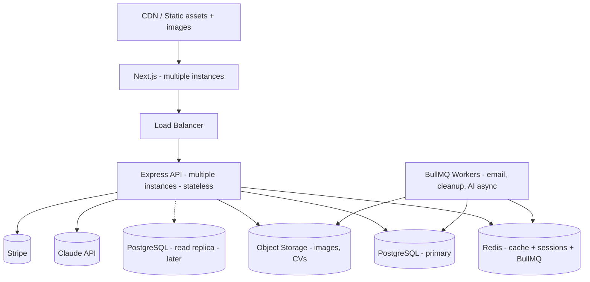

# Declay Store — System Design

**Companion to:** `01-requirements-brd-srs.md`, `02-diagrams.md`
**Date:** 2026-06-19 (original) · **Re-audited 2026-07-07**
**Status:** Draft v2 — reflects current architecture + recommended target state
**Audience:** Engineering

> **2026-07-07 re-audit:** the AI integration (§6.4), upload pipeline (§5.2), and several risks (§9) have changed materially since the original draft — see the inline notes below and `04-feature-backlog-roadmap-gap-analysis.md` §0 for the full list.

---

## 1. Architecture Overview

Declay Store is a **two-tier web application** with a clear separation between a Next.js presentation layer and a stateless Express REST API, backed by PostgreSQL and Redis, and integrated with Stripe, Google OAuth, SMTP, and (planned) the Claude API.

| Layer | Technology | Notes |
|-------|-----------|-------|
| Frontend | Next.js 16 (App Router), React 19, Tailwind v4 | Storefront `(storefront)` + Admin `admin/(protected)` route groups in one app |
| Backend | Node.js + TypeScript (ES2021), Express 4 | Stateless REST under `/api` |
| ORM | Sequelize 6 | `underscored: true` (camelCase models ↔ snake_case columns) |
| Database | PostgreSQL 15 (Docker) | Port **5431** (non-default) |
| Cache | Redis 7 (Docker) via ioredis | Port **6378** (non-default) |
| Auth | JWT (access+refresh) + Passport Google OAuth | Separate JWT secret for admin |
| Payments | Stripe (PaymentIntents, webhooks, refunds) | Online only |
| Email | Nodemailer + SMTP | Lib present; templates/triggers TBD |
| AI | Claude API (Anthropic SDK) | **Not yet installed**; planned |
| Validation | Zod 4 | Via `validate` middleware |

### 1.1 Design principles in force

- **Strict layering per module.** Every feature in `src/modules/<name>/` has six files: `entity`, `interface`, `validate`, `service`, `controller`, `route`. Services contain business logic and must not import Express types; controllers must not contain business logic.
- **Uniform response envelope.** All responses go through `utils/response.ts` (`sendSuccess`/`sendError`); never call `res.json()` directly.
- **Centralized errors.** Services throw `AppError`; `error-handler.ts` middleware formats responses.
- **Validation at the edge.** Zod schemas enforced by `validate` middleware in routes, not in controllers/services.
- **Config through one module.** All env access via `src/config/env.ts`; no inline `process.env`.

---

## 2. Request Lifecycle

A typical authenticated write request flows:

```
Client → CORS/Helmet → session → express.json
      → router (/api/<resource>)
      → auth middleware (routeProtect or adminProtect) → attaches req.user / req.admin
      → validate(zodSchema) → 400 on failure
      → controller → calls service
      → service (business logic, DB via Sequelize, cache via Redis, external APIs)
      → sendSuccess(res, data) / throw AppError
      → errorHandler (on throw) → sendError envelope
```

**Special case — Stripe webhook:** mounted *before* `express.json()` using `express.raw()` so the raw body is available for signature verification. This ordering in `app.ts` is intentional and must be preserved.

---

## 3. Authentication & Authorization Design

### 3.1 Two separate identity domains

Customers (`users`) and staff (`admin_users`) are deliberately distinct tables with distinct auth flows and **distinct JWT signing secrets** (`JWT_ACCESS_SECRET` / `JWT_REFRESH_SECRET` vs `JWT_ADMIN_SECRET`). This prevents privilege confusion: a customer token can never satisfy an admin route and vice versa.

- **Customer:** `routeProtect` verifies the Bearer access token, attaches `req.user` (`userId`, `email`).
- **Admin:** `adminProtect` verifies the admin JWT, attaches `req.admin` (`adminId`, `email`, `role`).
- **Refresh:** short-lived access tokens; refresh tokens exchanged at `/api/auth` for new access tokens.
- **Google OAuth:** Passport Google strategy; on first login, a `users` row is created with `auth_provider='google'` and nullable password.

### 3.2 Role model (admin)

Roles `super_admin`, `admin`, `editor` are stored on `admin_users.role`. **(Re-audited 2026-07-07)** A `requireRole(...roles)` guard now exists in `admin.middleware.ts` and is implemented correctly, but it is composed after `adminProtect` on exactly **one** router: `/api/admin/users` (`requireRole('super_admin')`). Every other admin router — products, orders (incl. status changes), discounts, banners, site settings, and the AI assistant — only requires *some* valid admin token, regardless of role. This means an `editor` account can currently delete products, refund/cancel orders via status change, mint discount codes, or drive the AI assistant to do the same. **Action:** apply `requireRole(...)` to the routers/actions it was clearly designed for, per the BRD's actor table (editor = content only, no destructive financial actions).

### 3.3 Recommended hardening

- Tighten CORS to the known frontend origin(s) per environment (currently `cors()` is permissive).
- Move Express session store to Redis for horizontal scaling and to survive restarts.
- Add an **audit log** table for admin write actions (who/what/when), important for a multi-staff store and for AI-assistant actions.
- Add rate limiting on auth and chat endpoints.

---

## 4. Data Model & Persistence

The schema (migrations `001`–`003`, 27 tables) is normalized 3NF with deliberate denormalization where it protects history:

- **Variant-level commerce.** `products` hold descriptive data; `product_variants` hold `price`, `stock`, `images[]`. Cart, wishlist, and order items all reference **variants**, never products.
- **Order immutability.** `order_items` snapshot `price_at_purchase`, `variant_name_at_purchase`, `product_name_at_purchase` so historical orders stay accurate even if products/variants change or are deleted (FK `ON DELETE RESTRICT` on variant for order items).
- **Referential rules** are intentional: `ON DELETE CASCADE` for owned children (cart_items, addresses), `ON DELETE RESTRICT` where deletion would corrupt financial history (orders→users, order_items→variants), `ON DELETE SET NULL` for soft links (order→address, banner→admin).
- **Constraints as guarantees:** partial unique index for one default address per user; `CHECK` on rating 1–5, quantity ≥ 1, discount value > 0; enums for order/application/chat/discount status.
- **Money:** `NUMERIC(10,2)` throughout — never floats.

### 4.1 Migration strategy

Migrations are raw idempotent SQL wrapped in Sequelize-CLI JS files (so `db:migrate` tracks them in `SequelizeMeta`). **Action item:** the app currently also calls `sequelize.sync()` in development, which can drift from migrations — standardize on migrations and disable `sync` outside throwaway dev, and add reverse DDL in the `down()` of each wrapper to enable rollback. Note the stale `config/config.json` (MySQL/root) and legacy `models/index.js` should be removed to avoid confusion; the live config is `config/database.js` (Postgres).

### 4.2 Caching

Redis-backed `cacheMiddleware(ttl)` on stable GET routes, keyed by path + user context, with tiers `FIVE_MIN`/`TEN_MIN`/`THIRTY_MIN`/`ONE_HOUR`. Services must invalidate related keys on mutation. Good candidates: category trees, product listings/detail, published articles, banners. Avoid caching cart/order/user-specific dynamic data.

---

## 5. API Design

REST under `/api`, resource-oriented, with parallel customer and admin routers. Conventions: lowercase hyphenated paths, standard envelope, pagination via `page`/`limit`, validation via Zod.

### 5.1 Current endpoint surface (audited)

**Customer**

| Method | Path | Purpose |
|--------|------|---------|
| POST | `/api/auth/register` | Register |
| POST | `/api/auth/login` | Login (JWT) |
| POST | `/api/auth/refresh` | Refresh token |
| GET | `/api/auth/google` · `/google/callback` | Google OAuth |
| GET/PUT | `/api/users/...` | Profile |
| CRUD | `/api/addresses` | Addresses |
| GET | `/api/categories` | Category tree |
| GET | `/api/products`, `/api/products/:slug` | Catalogue |
| CRUD | `/api/products/:productId/reviews` | Reviews (nested) |
| CRUD | `/api/cart` | Cart |
| CRUD | `/api/wishlist` | Wishlist |
| POST | `/api/orders/checkout` | Create checkout + PaymentIntent |
| GET | `/api/orders`, `/api/orders/:id` | Order history |
| POST | `/api/orders/:id/cancel` | Cancel/refund |
| GET | `/api/articles`, `/api/articles/:slug` | Blog |
| GET | `/api/jobs`, `/api/jobs/:id` | Careers |
| POST | `/api/jobs/:jobId/applications` | Apply |
| POST | `/api/webhooks/stripe` | Stripe webhook (raw body) |

**Admin** (`adminProtect`): `/api/admin/auth`, `/admin/users` (`requireRole('super_admin')`), `/admin/upload`, `/admin/articles`, `/admin/categories`, `/admin/products`, `/admin/reviews`, `/admin/discounts`, `/admin/banners`, `/admin/settings`, `/admin/assistant`, `/admin/orders`, `/admin/orders/:orderId/shipment`, `/admin/jobs`, `/admin/jobs/:jobId/applications`.

**Re-audited 2026-07-07 — additional customer-facing routes now built:** `POST /api/chat` (chatbot), `GET/POST/PUT/DELETE /api/discounts`, `GET /api/banners`, `GET /api/settings`, `GET /api/orders/:orderId/shipment`.

### 5.2 Planned endpoints (status as of 2026-07-07)

- ~~`POST /api/chat` — storefront chatbot (stream).~~ ✅ Built.
- ~~`POST /api/admin/assistant` — admin assistant (stream, tool-use).~~ ✅ Built, incl. `/api/admin/assistant/confirm` for the destructive-action confirmation gate.
- ~~`/api/admin/discounts` (CRUD) + discount application in `/orders/checkout`.~~ ✅ Built.
- ~~`/api/admin/banners` (CRUD) + public `/api/banners`.~~ ✅ Built.
- ~~`/api/admin/shipments` or extend `/admin/orders/:id/ship`.~~ ✅ Built as nested `/admin/orders/:orderId/shipment` — but populated by the new automated fulfillment simulation, not admin data entry (see §6.5).
- ~~`/api/admin/admin-users` (super_admin), `/api/admin/site-settings`.~~ ✅ Both built (`/admin/users`, `/admin/settings`); only `/admin/users` is actually role-gated to super_admin.
- `/api/admin/analytics/*` for dashboard KPIs. — 🔴 Still not found; a dashboard FE shell/component exists with no backing API.
- `/api/tags`, product/article tag association endpoints. — 🔴 Still not built.
- File upload endpoints (product images, CVs) once storage is chosen. — 🟡 `/api/admin/upload` built (multer → local disk, admin-only, images only, 5MB cap). Storage choice was made implicitly (local disk, not S3/Cloudinary) rather than decided by the product owner, and there is still no CV upload path for public job applicants.

---

## 6. Integration Designs

### 6.1 Stripe (built)

- **Checkout:** `order.service.createFromCart` computes the total, creates a PaymentIntent, persists the order in `pending_payment` with `stripe_payment_intent_id`, returns `clientSecret`. Frontend confirms with Stripe.js Elements.
- **Confirmation:** webhook `payment_intent.succeeded` → `markAsPaid` flips status to `paid` (the source of truth; client confirmation is never trusted).
- **Refunds:** `cancelOrder` issues `stripe.refunds.create` when a paid order is cancelled.
- **Hardening needed (re-audited 2026-07-07 — all four items still open):** (a) webhook **idempotency** — `stripeWebhook` still has no de-dup and `markAsPaid` has no guard on current order status, so a duplicate `payment_intent.succeeded` delivery re-decrements stock, re-enqueues the fulfillment pipeline, and re-sends emails; **this is now the single highest-priority open risk**, since more automation depends on `markAsPaid` than when this was first flagged; (b) `payment_intent.payment_failed` / `canceled` still not handled; (c) **stock decrement** now happens inside the `markAsPaid` transaction via `ProductVariant.decrement(...)`, which is atomic at the SQL level, but still has no `WHERE stock >= qty` floor guard, so oversell under concurrent checkouts remains possible; (d) abandoned `pending_payment` orders still have no TTL sweep.

### 6.5 Automated Fulfillment Simulation (new, re-audited 2026-07-07)

Not present in the original design. A new BullMQ queue (`src/lib/shipping-queue.ts` + `src/lib/shipping.ts`) automatically walks every `paid` order through `processing → shipped → delivered` on a delay schedule (`config.shipping.*DelayMs`), with no admin action:

- On `to-shipped`, it **fabricates** a carrier name and tracking number from the shipping address's city/country (e.g., "GHN Express" for major Vietnamese cities, "DHL Express" for international) via `estimateShipping()` — there is no real carrier/aggregator integration.
- Each step guards on the order's current status before acting (e.g., `to-processing` no-ops if the order isn't `paid`), and job IDs are deterministic (`fulfill:${orderId}:${step}`) so re-running `reconcileFulfillment()` on boot won't duplicate in-flight jobs.
- Customers receive real "shipped" / "delivered" emails referencing this fabricated tracking data.

**This is a business-rule question, not just a technical one.** It directly changes the meaning of FR-ORD-8 and D1 in the backlog (from "admin records real shipment info" to "system pretends to ship on a timer"). Recommend an explicit product-owner decision: keep as an intentional simulation (e.g., useful for a demo/staging environment, but must be disabled or replaced before real orders/money), or replace with either manual admin entry or a real carrier API integration before launch.

### 6.2 Google OAuth (built)

Passport Google strategy; callback URL must exactly match the Google Cloud Console registration (protocol + port). New OAuth users get `auth_provider='google'`, nullable password.

### 6.3 Email / SMTP (partial)

`src/lib/email.ts` exists. Needed: templated transactional emails and triggers for email verification, password reset, order confirmation, and shipping updates; bounce/error handling; from-address via `EMAIL_FROM`.

### 6.4 Claude API — AI features (re-audited 2026-07-07: built)

Implemented via `@anthropic-ai/sdk` (`src/lib/claude.ts`), with `ANTHROPIC_API_KEY`, `ANTHROPIC_STOREFRONT_MODEL` and `ANTHROPIC_ADMIN_MODEL` in `.env.example` (both currently default to `claude-haiku-4-5`).

- **Storefront chatbot (`POST /api/chat`):** `chat` module, SSE streaming to `ChatWidget.tsx`, persists to `chat_sessions`/`chat_messages`. No tools are registered for this surface, so it is read-only by construction (matches the intended design).
- **Admin assistant (`POST /api/admin/assistant` + `/confirm`):** behind `adminProtect` (not yet role-restricted — see §3.2). Real tool-use loop (`assistant.service.ts`, `assistant.tools.ts`) against internal services: reads (`search_products`, `get_order`, `list_orders`, `list_articles`) and non-destructive writes (`create_product`, `update_product`, `create_category`, `create_discount`, `create_banner`) execute immediately; destructive tools (`update_order_status`, `publish_article`, `delete_product`) pause via a Redis-backed pending-confirmation state (10-min TTL) and an SSE `confirm` event, resumed by `POST /confirm`. System prompt caches via `cache_control: { type: 'ephemeral' }`; tool-call loop is capped at 6 rounds. Tool invocations are persisted into `chat_messages.tool_calls` (JSONB) but there is **no separate, queryable audit log** — the recommended `audit_log` table (§9) is still not present.
- **Gaps vs. the original target design:** (a) `create_discount`/`create_banner` are classified non-destructive despite direct revenue/content impact — worth reclassifying or bounding server-side; (b) no role restriction, so any `admin`/`editor` token can drive the full tool set; (c) no rate limiting on either `/api/chat` or `/api/admin/assistant` — direct, uncapped Claude API cost exposure if a token is reused or the widget is looped.

---

## 7. Frontend Architecture

- Next.js App Router with two route groups: `(storefront)` (public) and `admin/(protected)` (auth-gated layout enforcing admin auth — no per-page duplication).
- Prefer Server Components for data fetching; Client Components only for interactivity (cart, checkout, forms, future chat widget).
- API base URL from `NEXT_PUBLIC_API_URL`; never hardcode.
- Visual system: warm/artisan — earthy palette, textured backgrounds, generous whitespace, applied consistently.
- Audited pages exist for: home, products list/detail, cart, checkout, orders list/detail, blog list/detail, careers list/detail, login/register, OAuth callback; admin dashboard, products, articles, categories, jobs, orders, login. **Missing FE:** wishlist page, reviews UI, discounts UI, banners UI, chat widget, admin analytics widgets.

---

## 8. Non-Functional Design Decisions

| Concern | Decision / recommendation |
|---------|---------------------------|
| **Scalability** | Stateless API; move session to Redis; cache hot reads; consider read replicas later. |
| **Reliability** | Wrap financial mutations in transactions; webhook idempotency; retry/queue for emails (BullMQ + Redis already in deps). |
| **Security** | Tighten CORS; rate-limit auth/chat; audit log; secrets via env only; SSL DB in prod; sanitize AI context. |
| **Observability** | Add structured logging + error tracking (e.g., Sentry) + basic metrics; keep morgan for dev. |
| **Background jobs** | `bullmq` is already a dependency — use it for email sending, abandoned-order cleanup, and async AI tasks. |
| **Testing** | Adopt Vitest (backend) + React Testing Library (frontend); prioritize order/payment service tests and webhook handling. No Jest. |
| **Config** | Non-default ports (PG 5431, Redis 6378) are a recurring footgun — keep documented and env-driven. |

---

## 9. Key Technical Risks

| Risk | Impact | Mitigation | Status (2026-07-07) |
|------|--------|-----------|:---:|
| Oversell under concurrent checkout | Negative stock, fulfillment failures | Atomic conditional stock decrement; reserve-on-checkout or decrement-on-paid with guard | 🔴 Open — decrement is in a transaction but has no `stock >= qty` floor |
| Webhook replay / duplicate processing | Double stock decrement, double emails, double fulfillment-pipeline enqueue, double discount usage count | Idempotency keys / processed-event table, or a status guard at the top of `markAsPaid` | 🔴 Open — **highest priority**, blast radius grew since more automation now hangs off `markAsPaid` |
| `sequelize.sync()` vs migration drift | Schema mismatch, runtime errors | Disable sync outside dev; single source of truth = migrations | 🟡 Not reverified this pass |
| Abandoned `pending_payment` orders | Stale orders, locked stock (if reserved) | Scheduled sweep to cancel/expire | 🔴 Open — no sweep job found |
| AI assistant performing unintended writes | Data corruption, trust loss | Confirmation gate, scoped tools, audit log, admin-only auth | 🟡 Confirmation gate ✅ built and working for tools flagged `destructive`; scoped tools 🟡 (no role scoping); audit log 🔴 still missing; admin-only auth ✅ (but not role-scoped) |
| File uploads unsolved | Blocks product media & CVs | Choose storage (S3-compatible/Cloudinary) early | 🟡 Product/variant images ✅ unblocked via local disk (not object storage); CV upload 🔴 still unsolved |
| Permissive CORS / default session store | Security & scaling gaps | Restrict origins; Redis-backed sessions | 🟡 Not reverified this pass |
| **(new)** Automated fulfillment simulation | Customers notified of "shipped/delivered" for orders never physically shipped; real carrier integration absent | Product-owner sign-off; replace with manual entry or real carrier API before launch | 🔴 Open — new since original audit, see §6.5 |
| **(new)** Role enforcement built but not applied | `editor` accounts can perform destructive/financial admin actions the BRD says they shouldn't | Apply existing `requireRole()` guard across admin routers per the BRD actor table | 🔴 Open — guard exists, applied to 1 of ~15 admin routers |
| **(new)** No rate limiting on AI endpoints | Uncapped Claude API cost exposure via `/api/chat` and `/api/admin/assistant` | Add per-user/per-admin rate limiting | 🔴 Open |
| **(new)** Large uncommitted working tree | No version history / rollback point / review trail for ~19 days of new functionality (incl. the AI write-path) | Commit in reviewable increments now | 🔴 Open — 277 modified + 81 untracked files as of this audit |

---

## 10. Recommended Target Architecture (next iteration)


