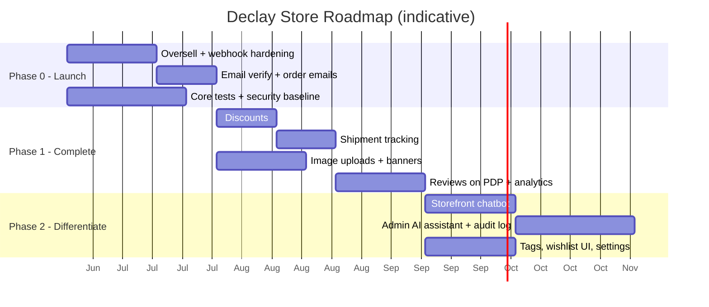

# Declay Store — Feature Backlog, Roadmap & Gap Analysis

**Companion to:** `01-requirements-brd-srs.md`, `02-diagrams.md`, `03-system-design.md`
**Date:** 2026-06-19 (original) · **Re-audited 2026-07-07**
**Audience:** Product owner, engineering lead

> **2026-07-07 re-audit note:** The working tree contains ~19 days of uncommitted work (last git commit 2026-06-18; 277 modified + 81 untracked files at audit time) that is **not reflected in the 2026-06-19 version of this document**. Section 0 below summarizes what changed. Section 1's table has been updated in place; superseded notes are struck through in spirit (replaced, not literally struck) and marked "(re-audited)".

---

## 0x. Campaigns Made Visible, Collections Made Usable — Shipped 2026-08-06

Closes the two findings from the collections/campaigns review (§0z "Still open").

**Campaigns: a filter, not a page.** The decision was to give campaigns no page of their own — a campaign is a *filter over the shop*, addressed as `/products?campaignId=N`. `getActiveProductIds` returns nothing unless the campaign is inside its window, so a stale marketing link degrades to an empty shop instead of advertising a discount checkout will not apply. On top of that filter:

- **Announcement bar** — site-wide strip, dismissible per campaign id (so the next campaign still gets its chance), countdown shown only inside a 3-day urgency window.
- **Named badge on the product card** — "Tet Sale −30%" instead of a bare "−30%", driven by the server's `source` field. A permanent special price stays generic; only a campaign earns a name.
- **Ribbon + countdown on the product page** — the highest-converting placement, since the customer is already deciding.
- **`banners.campaign_id`** (migration 034) — the banner module already had image/link/schedule/position, so this was wiring, not a new feature. A linked banner disappears when its campaign stops. Relying on an admin to switch it off is how a shop ends up advertising a sale the checkout no longer honours.

**Collections: the same shop, scoped.** The collection page was a bare grid — no filters, no sort, no pagination — so a customer arriving from a collection link got a visibly worse shop than one arriving from `/products`. It now reuses the *same* `ProductFilters` / `ProductSort` / `ProductsInfinite` components with the title swapped for the collection name and the result set locked to that collection (Nike's Air Force 1 series page as the model). `basePath` was added to the two navigating components — without it, touching any filter threw the customer back to `/products`.

New tests: `campaign-display.test.ts` (21) — countdown maths, headline selection, badge attribution.

**Collections as a merchandising surface (added later the same day).** Collections were reachable only through a filter chip and a text-only index; nothing about them was sellable. Now:

- **`CollectionCarousel`** — cover image, name, and a horizontally scrollable row of the collection's real products, reusing `ProductCard` verbatim so a product looks identical here, in the shop grid and on a collection page.
- Rendered on the **home page** (first 3 by `sortOrder`) and on **`/collections`** (all of them). One component, so the two surfaces cannot drift.
- **`GET /api/collections?withProducts=N`** attaches the preview server-side — avoids an N+1 request per collection — and **omits collections with nothing visible to show**. A heading with no products under it reads as a broken page, not a curated group.
- **Collections removed from the top-level nav.** A collection is a way of browsing the shop, not a destination competing with it, so the entry point is now "All collections" inside the Shop mega-menu's *By Collection* column (and the mobile drawer).
- **`collections.image_url`** (migration 035) instead of a per-collection banner table. The banner module's value is *scheduling*; a collection is evergreen, so that machinery would be dead weight plus another switch to forget. One column earns its keep in four places: home carousel, collections index, collection page header, and the **OG share card** — collection links previewed as blank cards until now, which matters for a shop whose traffic arrives from social.

**Still open:** the banner admin form has no campaign picker yet (column and API exist) — W-63. No "on sale" filter chip in the shop sidebar — W-58.

---

## 0y. Chat & AI Promoted into the MVP — Shipped 2026-08-06

Chatbot, admin assistant and human live chat are now **MVP MUST** (`discovery/03` §2, `discovery/10` FR-29..37). Two of the three already existed; one was built.

| Feature | Before | Now |
|---|---|---|
| **Storefront chatbot** | Built, but the system prompt described a **Stripe card-only shop with a 14-day return window** — neither true. It was telling customers the wrong payment and return policy in production. | Prompt corrected to COD/VNPay + 7-day returns (BR-06). New `list_my_orders` tool: customers ask "where is my order", not "what is the status of order 4172". |
| **Admin AI assistant** | Built (tool-use loop + Redis confirmation gate for destructive tools). | Unchanged, moved into MVP scope. History loader hardened against the new `staff`/`system` roles, which would otherwise 400 the Messages API. |
| **Customer ↔ staff live chat** | **Did not exist.** Every question the bot could not answer was a dead end. | Built: handoff on the **same session** (staff inherit the transcript), staff inbox, SSE + Redis pub/sub, presence, out-of-hours email fallback. Guests included. |

**Transport decision.** SSE + Redis pub/sub, not WebSocket. Traffic is overwhelmingly server→client; the client→server direction is a plain POST. The project already streams AI replies over SSE and already runs ioredis, so socket.io would add a dependency and a sticky-session requirement without solving anything new.

**Privacy.** Transcripts contain order details, so every customer-side read verifies ownership (`userId` or `guestSessionId`). Knowing a session id is not enough — this was a deliberate guard, since the old chat endpoint accepted any session id it was handed.

New tests: `chat-handoff.test.ts` (21) covering the state machine, who-may-speak rules, and queue ordering.

**Still open (see `05` §2d):** Render's free plan sleeps on idle, which drops SSE connections — the frontend has no reconnect/backoff yet (W-52). No Claude API cost ceiling or alerting (W-53). AI assistant writes still land only in `chat_messages.tool_calls`, not a queryable audit log (W-54).

---

## 0z. Pricing & Campaign Rework — Shipped 2026-08-05

Three findings from the collections/campaigns review were fixed in code. Recorded here so the next audit does not re-report them.

| # | Finding | Fix |
|---|---|---|
| 1 | **Pricing rule duplicated 4×.** `web-api/src/lib/pricing.ts` claimed to be the single source of truth, but `web-fe/lib/utils.ts`, `ProductCard.tsx` and `ProductDetail.tsx` each re-implemented it — **unrounded** and with **no frontend test framework** to catch drift. | Server now stamps `effectivePrice`/`discountPercent`/`onSale`/`source` onto every variant (`computeVariantPricing` + `decorateVariantsPricing`), applied in product detail, product list, cart and **collection detail** (which previously served un-discounted prices). Frontend reads via a single `pricingOf()` reader. |
| 2 | **Campaigns were unmeasurable.** Nothing linked an order to the campaign that priced it, so "best-selling SKU" and "SKU that was on sale" were indistinguishable — which would have made the validation month's conclusion unusable. | Migration `032` adds `campaign_id`, `campaign_name_at_purchase`, `campaign_discount_percent`, `campaign_discount_amount`, `base_price_at_purchase` to `order_items`. Top-SKU report gains `organicUnits` + `campaignDependency`; new endpoint `GET /api/admin/reports/campaign-performance`. Attribution is deliberate: a campaign that **lost** to a cheaper special price is not credited. |
| 3 | **No margin floor.** `cost_price` was collected and shown to admins but never used defensively; discount codes stack on campaign pricing, so two discounts could push a sale below cost silently. | `campaign.margin.ts` + `POST /api/admin/campaigns/preview-impact` dry-run the damage while the admin is still editing (below-cost, thin-margin, overlap with running campaigns). **Warn, never block** — a customer must not be refused for an admin's pricing mistake. Orders that do sell below cost are logged. |

Also fixed: campaign edits now invalidate **product** caches (they changed prices while cached responses served the old ones); collections gained caching + invalidation; public `productCount` counts only visible products; the `/collections` nav link was un-commented.

New tests: `variant-pricing.test.ts` (11), `campaign-margin.test.ts` (9), `campaign-report.test.ts` (9).

~~**Still open:** campaigns remain invisible to customers…~~ — ✅ **Closed 2026-08-06, see §0x.** Remaining from this item: frontend still has no test framework, so `pricingOf()`'s fallback branch is unverified (W-45).

---

## 0. Critical Findings — Code Re-Audit (2026-07-07)

Since the original audit, most items previously marked 🔴 have real implementations (AI chatbot, AI assistant, discounts, banners, site settings, shipment tracking, admin-user management, image upload, transactional emails via BullMQ). This is substantial progress. However, the re-audit surfaced **new risks that did not exist in the original gap table** because the features they affect didn't exist yet:

1. **No webhook idempotency, and it is now higher-impact than before.** `payment.controller.stripeWebhook` still calls `orderService.markAsPaid()` with no de-dup, and `markAsPaid` has no guard on current order status before decrementing stock. A duplicate Stripe delivery of `payment_intent.succeeded` (Stripe explicitly retries on non-2xx, and duplicates are a documented possibility) will: decrement variant stock a second time, double-count discount code usage, re-send the "paid" email, and re-enqueue the fulfillment pipeline. **This was flagged in the original doc (A2) but the blast radius has grown** because more automation now hangs off `markAsPaid`. Fix: short-circuit if `order.status !== 'pending_payment'` at the top of `markAsPaid`, before the transaction.
2. **Order fulfillment (processing → shipped → delivered) is fully simulated, not real.** A new BullMQ pipeline (`src/lib/shipping-queue.ts`, `src/lib/shipping.ts`) automatically advances every paid order through the full lifecycle on a timer, fabricating a carrier name and tracking number from the shipping address's city/country — with **no human/admin action and no real carrier integration**. Customers will receive "shipped with tracking GHN..." emails for orders nobody has physically packed. This must be explicitly confirmed with the product owner as an intentional interim simulation (e.g., for demos) before real money is taken — otherwise it is a false-advertising / customer-trust risk at launch.
3. **Role enforcement infrastructure exists but is applied to exactly one route.** `requireRole()` middleware is implemented and correct, but it is only wired on `/api/admin/users` (super_admin-only). Every other admin route — including `delete_product`, `update_order_status`, `create_discount`, `create_banner`, and the entire AI assistant — is reachable by any authenticated admin regardless of role (`admin` or `editor`). This contradicts the BRD's stated intent (BR/actor table: editor = "no destructive financial actions"). FR-ADM-2 and H5 should move back to 🟡, not ✅.
4. **AI admin assistant has no role check and classifies write actions by "hard to undo," not by financial risk.** `create_discount` and `create_banner` execute immediately without confirmation (`destructive: false`) even though a discount code has direct revenue impact (mitigated somewhat: Zod caps percent discounts at ≤100 and requires value > 0, but there is no cap on `maxUses`/no bound preventing an unintentionally broad code). Any admin or editor with a valid token can ask the assistant to delete products, change order status, or mint discount codes. See Section 0a for the full assessment.
5. **Email verification & password reset: backend is done, frontend is not.** `auth.service.ts` (`verifyEmail`, `forgotPassword`, `resetPassword`) and the BullMQ `email-queue.ts` are fully implemented and send real templated emails. But no page under `web-fe/app/(storefront)` consumes a `?token=` link for either flow — a customer clicking the emailed link has nowhere to land. FR-AUTH-5/6 and B1/B2 should read "backend ✅ / frontend 🔴", not a blended 🟡.
6. **Image upload is local disk, not object storage — and doesn't cover CVs.** `modules/upload` (admin-only) saves files to `public/uploads` on the API container's local filesystem via multer. This unblocks product/variant image uploads but: (a) is incompatible with the horizontally-scaled / stateless target architecture in `03-system-design.md` §10 (files vanish or become inconsistent across instances/redeploys without a shared volume or CDN), and (b) job applicants still cannot upload a CV file — `job_applications.cv_url` only accepts a pre-hosted URL via Zod `.url()` validation; there is no public-facing upload endpoint (the only upload route requires `adminProtect`). FR-JOB-2 and E1 should stay partially open.
7. **No rate limiting anywhere** (`express-rate-limit` not in `package.json`, no rate-limit middleware found) — recommendation I2 from the system design doc is still fully open, and now covers two new unmetered, cost-bearing endpoints (`/api/chat`, `/api/admin/assistant`) calling the Claude API.

### 0a. AI Admin Assistant — Risk Assessment

The tool-use design itself is solid: a `destructive: boolean` flag per tool drives a pause-for-confirmation flow (Redis-backed pending state, 10-minute TTL, SSE `confirm` event), the system prompt instructs the model to never fabricate data and to rely on tools, and `MAX_TOOL_ROUNDS = 6` bounds runaway loops. Remaining gaps, in priority order:

| # | Gap | Why it matters | Suggested fix |
|---|-----|-----------------|----------------|
| 1 | No `requireRole` on `/api/admin/assistant` | An `editor` (content-only per BRD) can use natural language to delete products or change order status | Gate the route, or gate individual tools inside `safeExecute` by `ctx.role` |
| 2 | `create_discount` / `create_banner` are non-destructive (execute instantly) | A misinterpreted prompt can mint a live, usable discount code with no confirmation step | Reclassify as `destructive: true`, or add server-side bounds (e.g. max value, mandatory `expiresAt`) |
| 3 | No audit trail beyond `chat_messages.tool_calls` JSONB | Tool calls are not queryable/reportable as an audit log (H4 in the original backlog is still 🔴); hard to reconstruct "who told the AI to do what" across a support/incident review | Add a dedicated `audit_log` table populated from `safeExecute`, independent of chat history retention |
| 4 | No rate limit on `/api/admin/assistant` or `/api/chat` | Direct Claude API cost exposure if a token is reused/compromised or a user loops the widget | Add per-admin/per-session rate limiting |
| 5 | `confirm()` looks up pending state by `pendingId` alone, not scoped to the requesting admin | Low likelihood (UUID, server-generated, never displayed to other admins) but no defense-in-depth if the ID leaks (e.g., via logs) | Store `adminId` in `PendingState` and check it matches the confirming admin |

None of these are launch-blocking for the *storefront chatbot* (`/api/chat` is read-only, no tools per the code) — the risk is concentrated entirely in the *admin assistant's* write path.

---

## 1. Gap Analysis — Documented Intent vs Actual Code

Audited against migrations, route registration, and module contents. This is the most important section for planning: several features have **database tables but no implementation**.

Status: ✅ Built & route-wired · 🟡 Partial · 🔴 Tables/scaffold only, not functional

| Capability | DB schema | Backend module | Routes wired | Frontend | Status | Notes (re-audited 2026-07-07) |
|------------|:---------:|:--------------:|:------------:|:--------:|:------:|-------|
| Customer auth (email/JWT) | ✅ | ✅ | ✅ | ✅ | ✅ | Access+refresh tokens; JWT revocation/denylist added (`token-revocation.ts`) |
| Google OAuth | ✅ | ✅ | ✅ | ✅ | ✅ | Passport strategy |
| Email verification | ✅ | ✅ | ✅ | 🔴 | 🟡 | `auth.service.verifyEmail` + BullMQ email queue built and send real emails; **no FE page consumes the `?token=` link** |
| Password reset | ✅ | ✅ | ✅ | 🔴 | 🟡 | `forgotPassword`/`resetPassword` built; **no FE page** for the reset link |
| Profile & addresses | ✅ | ✅ | ✅ | ✅ | ✅ | `(storefront)/account` page now exists; one-default-address constraint enforced |
| Admin auth (separate) | ✅ | ✅ | ✅ | ✅ | ✅ | Separate JWT secret, `adminProtect` |
| Role enforcement (3 roles) | ✅ | ✅ (middleware) | 🟡 | — | 🟡 | `requireRole()` implemented correctly but **only wired on `/api/admin/users`**; every other admin route (incl. delete product, order status, discounts, AI assistant) accepts any role |
| Categories | ✅ | ✅ | ✅ | ✅ | ✅ | Hierarchical |
| Products & variants | ✅ | ✅ | ✅ | ✅ | ✅ | Variant-level price/stock |
| Catalogue browse/search | ✅ | ✅ | ✅ | ✅ | ✅ | Caching available |
| Image upload pipeline | ✅ | ✅ (local disk) | ✅ | ✅ (`ImageUploader.tsx`) | 🟡 | Admin-only, multer → local `public/uploads`, 5MB, image types only. Works for a single instance; **not object storage**, conflicts with the stateless/scaled target architecture |
| Cart | ✅ | ✅ | ✅ | ✅ | ✅ | Variant-based |
| Wishlist | ✅ | ✅ | ✅ | ✅ (`WishlistButton.tsx` + page) | ✅ | FE page and button now exist |
| Checkout + Stripe PaymentIntent | ✅ | ✅ | ✅ | ✅ | ✅ | Order created pending_payment |
| Stripe webhook → paid | ✅ | ✅ | ✅ | n/a | 🟡 | Signature-verified, but **no idempotency guard** — see Section 0 item 1 |
| Stock decrement on paid | ✅ | 🟡 | n/a | n/a | 🟡 | `ProductVariant.decrement` inside a transaction, but no `WHERE stock >= qty` floor and no re-check of order status before decrementing → oversell + double-decrement both still possible |
| Order history & cancel/refund | ✅ | ✅ | ✅ | ✅ | ✅ | Refund via Stripe |
| Order fulfillment automation | n/a | ✅ (new) | n/a | n/a | ⚠️ | **New, not in original scope.** BullMQ pipeline auto-advances paid→processing→shipped→delivered on a timer with a fabricated carrier/tracking number — no admin action, no real carrier API. Needs explicit product-owner sign-off before go-live (see Section 0 item 2) |
| Discount codes | ✅ | ✅ | ✅ | ✅ (`/admin/discounts`) | ✅ | Percent capped ≤100, positive value, min order/max uses/expiry supported; wired into checkout total and `markAsPaid` usage counting |
| Shipment tracking | ✅ | ✅ | ✅ | 🟡 | 🟡 | Now auto-populated by the fulfillment simulation (see above) rather than admin-entered; customer-facing "my shipment" endpoint exists |
| Product reviews | ✅ | ✅ | ✅ | ✅ (`ProductReviews.tsx`) | 🟡 | Controller/service/route now present; verified-purchase logic still to confirm |
| **Journals** (blog / articles) | ✅ | ✅ | ✅ | ✅ | ✅ | Public + admin. **Promoted to MVP-MUST 2026-08-05** (`discovery/03` §2). Public reads cached 10 min; drafts hidden; slug unique; views counted |
| Banners / merchandising | ✅ | ✅ | ✅ | ✅ (`BannerCarousel.tsx`, `/admin/banners`) | ✅ | Public list cached (10 min), admin CRUD |
| Tags (product/article) | ✅ | ✅ | ✅ | 🔴 | 🟡 | **Re-audited 2026-08-05: the "entity file only" note is stale.** `tag.service.ts`/`tag.controller.ts`/`tag.route.ts` exist and are mounted (`/api/tags`, `/api/admin/tags`); `Product`↔`Tag` and `Article`↔`Tag` associations are declared. Gap is now **FE only** — tags appear on no screen |
| Careers (jobs + applications) | ✅ | ✅ | ✅ | ✅ | ✅ | **Promoted to MVP-MUST 2026-08-05.** Re-audited: the earlier "CV upload still just a URL field" note is **stale** — `POST /api/careers/cv` is public (rate-limited, PDF/DOC/DOCX, 10 MB, → Cloudinary `declay/cvs`) and `ApplyForm.tsx` uses it. W-19 done. Remaining note: admin routes are `requireRole('admin','super_admin')`, so Editor/Staff cannot manage careers |
| Storefront AI chatbot | ✅ | ✅ | ✅ | ✅ (`ChatWidget.tsx`) | ✅ | **Promoted to MVP-MUST 2026-08-06.** Read-only by construction. 2026-08-06: system prompt corrected (was advertising Stripe + 14-day returns), `list_my_orders` tool added |
| **Live chat (customer ↔ staff)** | ✅ | ✅ | ✅ | ✅ (`/admin/inbox`, ChatWidget) | ✅ | **New 2026-08-06, MVP-MUST.** Handoff on the same session; SSE + Redis pub/sub; presence + out-of-hours email; guests supported |
| Admin AI assistant (tool-use) | ✅ | ✅ | ✅ | ✅ (`AssistantWidget.tsx`) | 🟡 | Fully functional tool-use loop with confirmation gate for destructive tools — see Section 0a for the specific gaps (role check, audit log, rate limit) |
| Chat persistence | ✅ | ✅ | n/a | n/a | ✅ | `chat_sessions`/`chat_messages` actively written by both chat and assistant modules |
| Admin-user management | ✅ | ✅ | ✅ | ✅ (`/admin/users`) | ✅ | The one route that correctly uses `requireRole('super_admin')` |
| Site settings | ✅ | ✅ | ✅ | ✅ (`/admin/settings`) | ✅ | Public GET cached 1h; admin CRUD, no role restriction (any admin/editor can change site settings) |
| Sales analytics dashboard | partial | 🔴 | 🔴 | 🟡 (`DashboardClient.tsx`) | 🔴 | FE shell/component added; still no `/api/admin/analytics/*` backend found |
| Transactional emails | ✅ | ✅ | n/a | n/a | ✅ | BullMQ-backed (`email-queue.ts`): verification, reset, order-status-change emails all wired with retry/backoff |
| Audit log (admin actions) | 🔴 | 🔴 | 🔴 | 🔴 | 🔴 | Still not present as a queryable table; AI tool calls only land in `chat_messages.tool_calls` JSONB |
| Automated tests | n/a | 🔴 | n/a | 🔴 | 🔴 | No test framework found in `package.json` — unchanged from original audit |

**Headline (updated):** The team has closed most of the feature gaps flagged on 2026-06-19 — AI chatbot, AI assistant, discounts, banners, site settings, shipment tracking, admin-user management, uploads, and real transactional emails are now built and route-wired. What's left is narrower but still launch-blocking: (1) webhook idempotency / double stock-decrement, (2) confirming whether the auto-fulfillment simulation is intentional, (3) applying the existing `requireRole` guard beyond admin-user management, (4) two missing frontend pages (email verify, password reset) that strand an otherwise-complete backend flow, (5) object storage for uploads + a real CV upload path, and (6) tests, audit log, and rate limiting.

---

## 2. Backlog — Epics & User Stories

Stories use `As a <role>, I want <capability>, so that <value>`. Estimates are T-shirt sizes (S/M/L). Priority: P0 (launch-blocking) · P1 (high) · P2 (later).
**Status column added 2026-07-07** reflecting the re-audit: ✅ done · 🟡 partially done · 🔴 not done.

### EPIC A — Commerce Hardening (P0)
- **A1 (M, P0)** 🟡 As a customer, I want my purchase to reliably decrement stock atomically, so that I never buy out-of-stock items and the store never oversells. *(Decrement is transactional but still has no floor guard — oversell under concurrency remains possible.)*
- **A2 (S, P0)** 🔴 As the business, I want Stripe webhooks processed idempotently and failed/cancelled payments handled, so order state always matches Stripe. *(Still no de-dup; `markAsPaid` will re-run in full on a duplicate webhook delivery — now also double-fires the fulfillment pipeline and discount usage count. Highest-priority open item.)*
- **A3 (S, P0)** 🔴 As the business, I want abandoned `pending_payment` orders auto-expired, so stale orders don't accumulate. *(No sweep job found.)*
- **A4 (M, P0)** ✅ As a customer, I want an order-confirmation email, so I have proof of purchase. *(Done via BullMQ `email-queue.ts`, triggered on every status change including `paid`.)*

### EPIC B — Account Completion (P0/P1)
- **B1 (M, P0)** 🟡 As a new user, I want to verify my email, so my account is trusted. *(Backend complete; no FE page to land on from the emailed link.)*
- **B2 (M, P1)** 🟡 As a user, I want to reset a forgotten password securely. *(Same gap: backend complete, FE page missing.)*
- **B3 (S, P1)** ✅ As a customer, I want a profile area to manage addresses in the UI. *(`(storefront)/account` page now exists.)*

### EPIC C — Promotions (P1)
- **C1 (M, P1)** ✅ As an admin, I want to create/manage discount codes (percent/fixed, min order, usage limits, expiry). *(Built, validated, admin UI at `/admin/discounts`.)*
- **C2 (M, P1)** ✅ As a customer, I want to apply a discount code at checkout and see the adjusted total. *(Wired into order total and usage counting on payment.)*

### EPIC D — Fulfillment & Shipping (P1)
- **D1 (M, P1)** ⚠️ As an admin, I want to record carrier + tracking number when shipping, so customers can track delivery. *(Implemented differently than scoped: carrier/tracking are auto-generated by a simulation, not admin-entered. Needs product-owner review — see Section 0 item 2.)*
- **D2 (S, P1)** ✅ As a customer, I want to see shipment status and tracking on my order, so I know when it arrives. *(`GET /api/orders/:orderId/shipment` built.)*
- **D3 (S, P2)** 🔴 As the business, I want a shipping-cost model (flat/threshold/weight) applied at checkout. *(Not found.)*

### EPIC E — Catalogue Media & Merchandising (P1)
- **E1 (L, P1)** 🟡 As an admin, I want to upload product/variant images to managed storage, so the catalogue has reliable media. *(Built, but local disk storage, not managed/object storage — see Section 0 item 6.)*
- **E2 (S, P1)** ✅ As an admin, I want to manage homepage banners (schedule, position, link). *(Built, incl. `BannerCarousel.tsx`.)*
- **E3 (S, P2)** 🔴 As an admin, I want to tag products/articles, so the storefront can offer tag-based discovery. *(Only an entity file exists; unchanged.)*

### EPIC F — Reviews & Social Proof (P1)
- **F1 (S, P1)** ✅ As a customer, I want to see ratings/reviews on product pages, so I can decide with confidence. *(`ProductReviews.tsx` now exists.)*
- **F2 (S, P1)** 🟡 As the business, I want reviews marked "verified purchase," so reviews are trustworthy. *(Column exists; verification logic not confirmed in this pass.)*
- **F3 (S, P2)** 🟡 As an admin, I want to moderate/hide reviews. *(Admin review router exists; moderation UX not confirmed.)*
- **F4 (S, P2)** ✅ As a customer, I want a wishlist page in the UI. *(`WishlistButton.tsx` + wishlist page now exist.)*

### EPIC G — AI Features (P1/P2) — the differentiator
- **G1 (L, P1)** ✅ As a customer, I want a read-only chatbot answering product/policy/order-status questions, so I get instant help. *(Built: `chat` module + `ChatWidget.tsx`, streamed, no tools registered — read-only by construction.)*
- **G2 (L, P2)** 🟡 As an admin, I want an AI assistant that can perform store actions via tool-use with confirmation, so routine ops are faster. *(Built and functionally solid — confirmation gate works — but no role restriction and no dedicated audit log; see Section 0a.)*
- **G3 (S, P2)** ✅ As the business, I want chat history persisted, so we can review and improve. *(`chat_sessions`/`chat_messages` actively used by both chat and assistant.)*

### EPIC H — Admin & Operations (P1/P2)
- **H1 (M, P1)** 🔴 As an admin, I want a dashboard with revenue, orders, top products, and conversion, so I can run the business. *(FE shell/component exists; no analytics API found.)*
- **H2 (S, P1)** ✅ As a super admin, I want to manage admin users and roles. *(Built, and correctly gated with `requireRole('super_admin')`.)*
- **H3 (S, P2)** ✅ As a super admin, I want to manage site settings (key/value). *(Built — but not role-gated; any admin/editor can change settings, not just super_admin as the story implies.)*
- **H4 (M, P1)** 🔴 As the business, I want an audit log of admin actions (incl. AI), for accountability. *(Still not present as a real table.)*
- **H5 (S, P1)** 🔴 As an admin, I want role-based access enforced per action, so editors can't perform admin-only operations. *(The guard exists in code but is applied to one route out of ~15 admin routers — effectively unenforced everywhere else.)*

### EPIC I — Quality, Security & Ops (P0/P1, cross-cutting)
- **I1 (M, P0)** Test suite (Vitest + RTL) starting with order/payment/webhook coverage.
- **I2 (S, P0)** Restrict CORS, add rate limiting on auth/chat, move sessions to Redis.
- **I3 (S, P1)** Structured logging + error tracking + basic metrics.
- **I4 (S, P1)** Standardize on migrations (disable `sync` outside dev; remove stale `config.json`/legacy `models`).
- **I5 (M, P1)** CI/CD pipeline + environment config for staging/prod.

---

## 3. Roadmap (phased)

> Sequencing optimizes for a safe revenue launch first, then the differentiating AI and growth features. Adjust per answers to the open questions in the BRD (esp. AI priority, storage, shipping).
>
> **2026-07-07 status:** most of Phase 1 (discounts, banners, image upload, reviews FE, wishlist FE) and most of Phase 2 (AI chatbot, AI assistant, chat persistence, site settings, admin-user management) are now built — engineering ran well ahead of this phased sequencing. What remains is concentrated back in **Phase 0**: webhook idempotency/stock-decrement safety, the two missing auth frontend pages, role enforcement, and the fulfillment-simulation sign-off. Treat the gantt below as historical intent, not current status; Section 5 is the live priority list.

### Phase 0 — Launch Readiness (P0) → "Take real money safely"
A1 oversell guard · A2 webhook idempotency/failure handling · A3 abandoned-order sweep · A4 order-confirmation email · B1 email verification · I1 core tests (order/payment) · I2 CORS/rate-limit/Redis sessions · I4 migration standardization.
**Exit:** A real customer can register, verify, buy, and pay; orders are correct and auditable; security baseline met.

### Phase 1 — Complete the Store (P1)
C1/C2 discounts · D1/D2 shipment tracking · E1 image uploads · E2 banners · F1/F2 reviews on PDP + verified purchase · B2/B3 password reset + address UI · H1 analytics dashboard · H5 role enforcement · I3 observability.
**Exit:** Feature-complete commerce with promotions, fulfillment visibility, media, and merchandising.

### Phase 2 — Differentiate & Grow
G1 storefront chatbot · G2 admin AI assistant + H4 audit log · G3 chat persistence · E3 tags & discovery · F3/F4 review moderation + wishlist UI · D3 shipping-cost model · H2/H3 admin-user & site-settings management · I5 CI/CD maturity.
**Exit:** AI-assisted shopping & ops live; growth and operational tooling complete.

---

## 4. Prioritization Rationale (MoSCoW snapshot)

- **Must (launch):** commerce hardening (A), email verification (B1), security baseline + core tests (I1/I2), migration hygiene (I4). Without these, taking real payments is risky. **(added 2026-08-05)** **Journals** (blog/articles, public + admin) and **Careers** (job listings, public application with CV upload, admin pipeline) — both already built, so the launch cost is content + UAT, not engineering. **(added 2026-08-06)** **Chatbot AI**, **Admin AI assistant** and **customer ↔ staff live chat** — the first two existed, live chat was built; remaining launch risk is infrastructure (SSE on a sleeping free plan) and API cost, not features.
- **Should (fast-follow):** discounts (C), shipping (D), media/banners (E), reviews (F1/F2), analytics (H1), role enforcement (H5). These complete the expected e-commerce experience.
- **Could (differentiate):** ~~AI features (G)~~ *(moved to Must 2026-08-06 — see §0y)*, audit log (H4), tags, wishlist UI, settings, advanced shipping. High value, but depend on budget and the prior foundation.
- **Won't (this cycle):** marketplace, multi-currency, subscriptions, native apps, POS.

---

## 5. Immediate Next Actions (this/next sprint)

> **Superseded 2026-07-07** — most of the original list (items 2–3 below) is now built. Revised priorities:

1. **Engineering (P0, do first):** add a status guard at the top of `order.service.markAsPaid` (`if (order.status !== 'pending_payment') return;`) and Stripe event-id de-dup on the webhook handler. This is now the single highest-risk open item — it silently double-decrements stock, double-fires the fulfillment/email pipeline, and double-counts discount usage on any duplicate webhook delivery.
2. **Product owner (P0, do first):** confirm whether the new automated fulfillment simulation (auto paid→processing→shipped→delivered with a fabricated carrier/tracking number) is intentional for launch, or must be replaced with real admin-entered / carrier-integrated shipping before taking real money.
3. **Engineering (P0):** ship the two missing frontend pages (email-verification landing, password-reset landing) — the backend and emails are already correct, this is the last mile to make B1/B2 actually usable.
4. **Engineering (P0/P1):** apply the existing `requireRole()` guard to the routes it was clearly designed for — at minimum: `delete_product`, `update_order_status` (admin+ only?), destructive discount/banner/site-setting operations, and the `/api/admin/assistant` route — per the BRD's editor/admin/super_admin scope.
5. ~~**Engineering (P1):** decide and implement an object-storage backend (S3-compatible/Cloudinary) to replace local-disk upload, and add a public (non-admin) CV upload endpoint for job applicants.~~ — ✅ **Done (verified 2026-08-05).** `src/lib/storage.ts` fronts Cloudinary; `POST /api/careers/cv` is public, rate-limited, PDF/DOC/DOCX only, 10 MB cap. W-18 + W-19 both closed.
6. **Engineering (P1):** add rate limiting on `/api/chat` and `/api/admin/assistant` (direct Claude API cost exposure) and a dedicated `audit_log` table fed from the assistant's tool executions.
7. **Engineering (P0, unchanged):** stand up Vitest with first tests on `order.service` (incl. the webhook-idempotency fix) and the Stripe webhook.
8. **Housekeeping (unchanged):** commit the current working tree in reviewable increments — 277 modified + 81 untracked files with no commits since 2026-06-18 is itself an operational risk (no rollback point, no code review trail for a very large amount of new functionality, including the AI write-path). Also: disable `sequelize.sync()` outside dev; remove stale `config/config.json` and legacy `models/index.js`.
