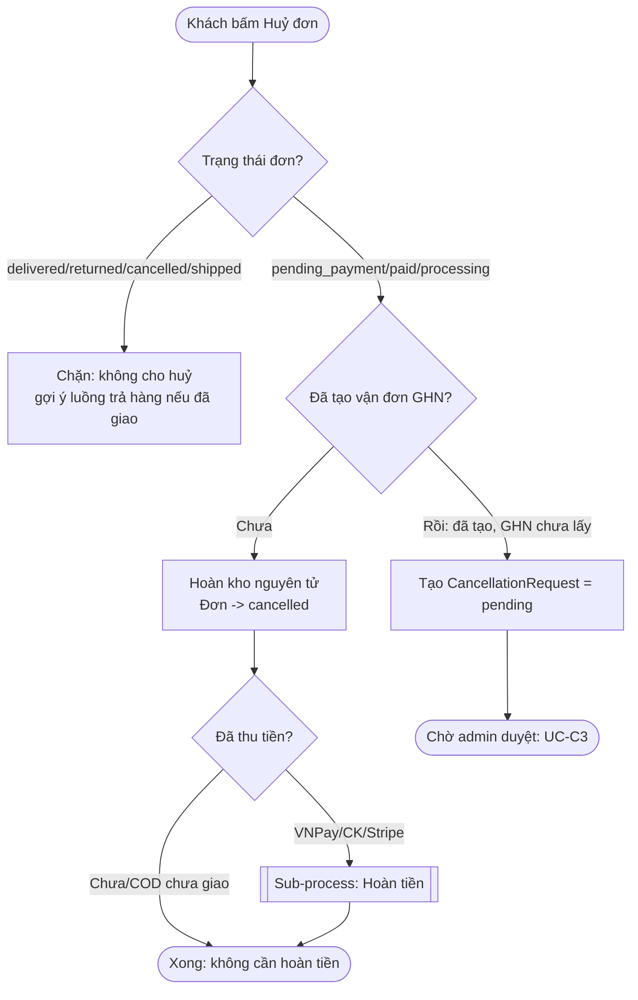
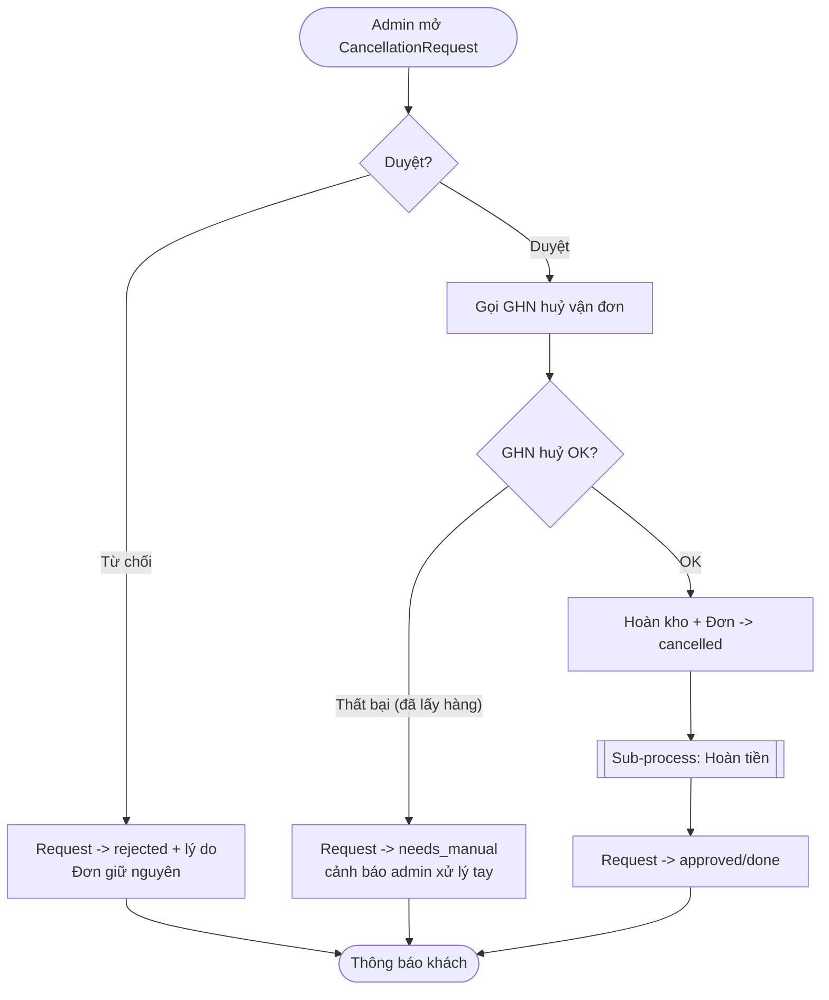
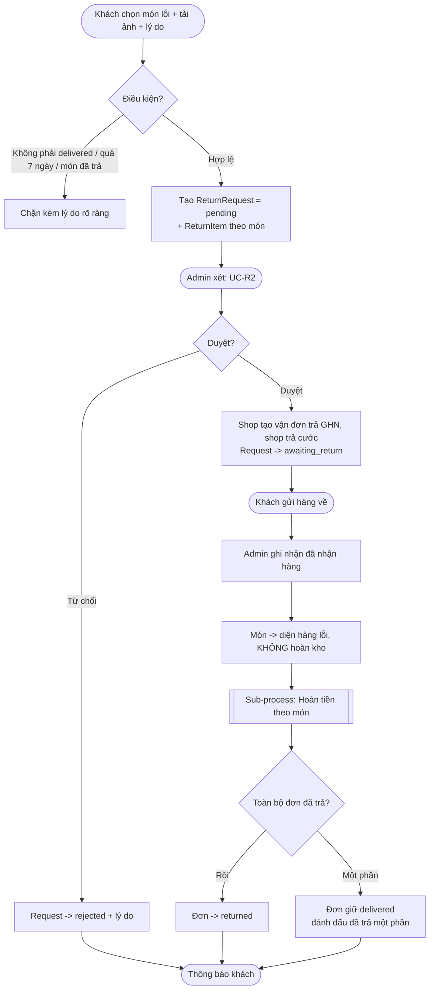
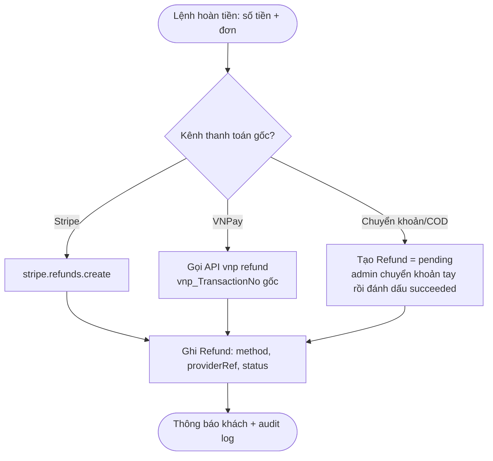
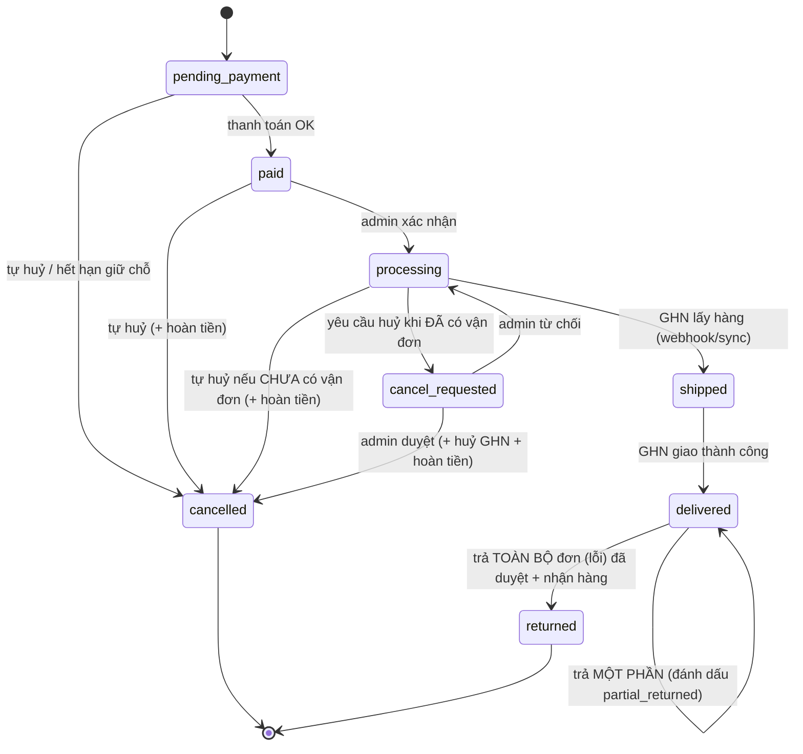
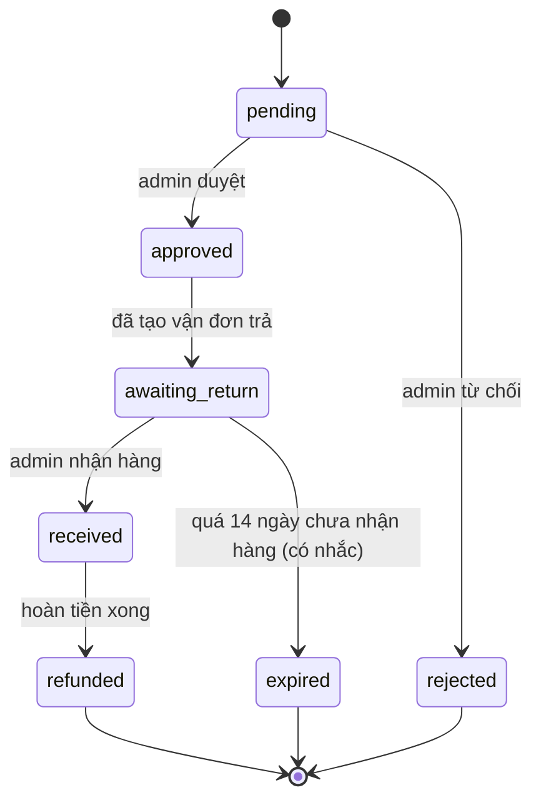
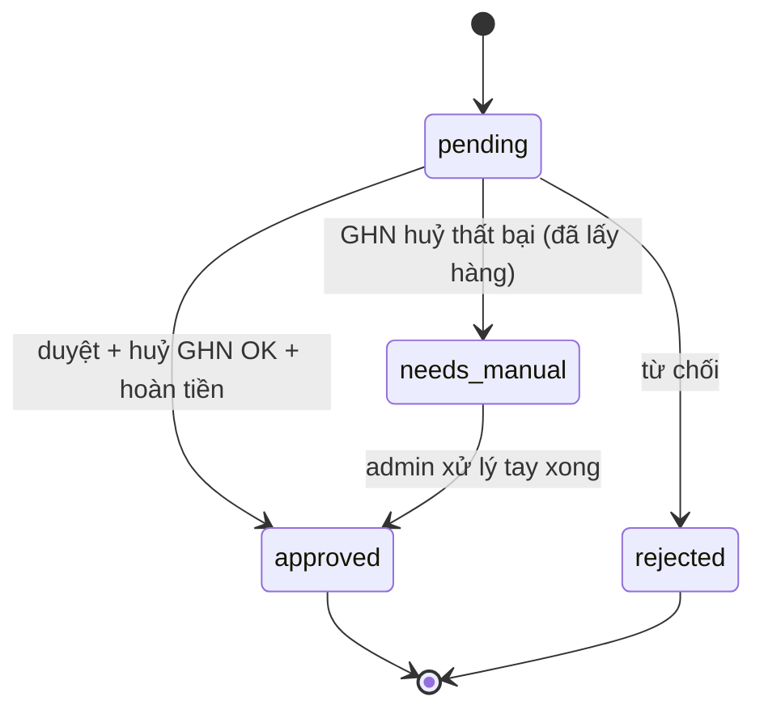

# 07 — Thiết kế Huỷ đơn & Đổi/Hoàn hàng (M-29)

> Tài liệu thiết kế nghiệp vụ cho hai luồng còn thiếu: **khách huỷ đơn** và **đổi/hoàn hàng lỗi**.
> Bám theo hiện trạng code thực tế (không thiết kế lại từ đầu). Ngày lập: 2026-07-31.
> Trạng thái: **DRAFT — chờ chốt các câu hỏi mở ở §15 trước khi code.**

---

## 0. Hiện trạng thực tế (khảo sát code)

Khác với "chưa có gì", một phần code đã tồn tại nhưng **không dùng được phía khách** và **có lỗ hổng tiền**:

| Hạng mục | Hiện trạng | Vấn đề |
|---|---|---|
| Huỷ đơn (BE) | `POST /orders/:id/cancel` → `order.service.cancelOrder(orderId, userId)` đã có; hoàn kho nguyên tử; hoàn tiền. | Chỉ hoàn tiền **Stripe**. Đơn **VNPay/chuyển khoản/COD** huỷ thì **không hoàn tiền, không ghi Refund**. Chỉ cho **user đăng nhập**. Chỉ huỷ khi `pending_payment`/`paid`. |
| Huỷ đơn (FE) | Không có nút, `lib/api.ts` không có hàm gọi. | Khách **không huỷ được** dù BE có endpoint. |
| Trả hàng (BE) | `POST /admin/orders/:id/return` (admin) → `returnOrder(orderId, reason)`. | Chỉ **admin** làm được. `returnOrder` chỉ đổi trạng thái + email: **không hoàn tiền, không hoàn kho, không vận đơn trả, không bằng chứng, không theo món.** |
| Trả hàng (khách) | Không có. | Khách **không có cách tự yêu cầu trả**. |
| Cửa sổ trả | `order.returns.ts`: `RETURN_WINDOW_DAYS = 7`, `returnRejectionReason()` thuần, đã test. | Có luật nhưng chưa gắn vào luồng khách. |
| Hạ tầng hoàn tiền | Model `Refund` (orderId, paymentId, stripeRefundId, amount, reason, status). | **Chỉ nối Stripe.** Chưa có API hoàn tiền VNPay, chưa có `method`/`type`/liên kết yêu cầu. |
| Huỷ vận đơn GHN | **Chưa có.** `ghn.provider.ts` không có hàm cancel. | Là **dependency** phải xây (endpoint GHN `switch-status/cancel`). |

---

## 1. Mục tiêu thực sự

Cho khách **chủ động huỷ đơn** và **báo trả hàng lỗi/sai** qua giao diện, đồng thời **đảm bảo tiền được hoàn đúng và có dấu vết** trên mọi kênh thanh toán (VNPay, chuyển khoản, COD, Stripe) — không để lỗ hổng "huỷ đơn đã trả tiền mà không hoàn".

Mục tiêu phụ: giảm tải CSKH (khách tự thao tác trong phạm vi cho phép), và giữ **kiểm soát của admin** ở những điểm phát sinh tiền/thao tác với hãng vận chuyển.

---

## 2. Chính sách đã chốt

Chốt qua 2 vòng xác nhận với product owner (2026-07-31):

| # | Quyết định | Chốt |
|---|---|---|
| P1 | Hoàn tiền đơn nội địa | **API hoàn tiền VNPay** cho đơn VNPay; **chuyển khoản tay** cho đơn chuyển khoản/COD (hệ ghi nhận `Refund`). Stripe giữ luồng cũ. |
| P2 | Mốc khách **tự** huỷ | Đến khi **chưa bàn giao GHN**: `pending_payment`, `paid`, `processing` — **với điều kiện chưa tạo vận đơn GHN**. |
| P3 | Huỷ khi **đã tạo vận đơn** GHN (còn ở processing, GHN chưa lấy hàng) | Không huỷ tức thì → tạo **Yêu cầu huỷ**, **admin duyệt**, hệ gọi API huỷ vận đơn GHN + hoàn tiền. |
| P4 | Trả hàng | **Chỉ nhận khi hàng lỗi/sai.** Shop chịu phí ship chiều về. |
| P5 | Hoàn kho | **Huỷ: hoàn kho** về bán tiếp. **Trả hàng lỗi: KHÔNG** tự hoàn kho — đưa vào diện "hàng lỗi", admin quyết. |
| P6 | Luồng báo lỗi | Bắt buộc **ảnh + lý do**, **admin duyệt**, cho trả **theo từng món** (hoàn tiền theo món). |
| P7 | Khách vãng lai | **Chỉ khách đăng nhập** mới huỷ/báo lỗi tự phục vụ. Vãng lai liên hệ CSKH (admin thao tác hộ). |
| P8 | Cửa sổ báo lỗi | **7 ngày** kể từ `deliveredAt`, **chung mọi sản phẩm** (tái dùng `RETURN_WINDOW_DAYS`). |
| P9 | Hoàn phí ship khi trả lỗi | Trả **toàn bộ** đơn → hoàn **cả phí ship gốc**; trả **một phần** → **không** hoàn ship. |
| P10 | Vận đơn chiều về | **Shop tạo vận đơn trả GHN**, shop trả cước; khách chỉ đóng gói. |
| P11 | Trả lại lượt mã giảm giá | **Huỷ**: trả lại lượt dùng mã. **Trả hàng lỗi**: **không** trả lại. |
| P12 | `awaiting_return` treo | Tự đóng sau **14 ngày** nếu chưa nhận được hàng, **có email nhắc** trước hạn. |
| P13 | Cờ trả một phần | **Thêm cột `orders.partial_returned`** (BOOLEAN) để truy vấn/hiển thị nhanh. |
| P14 | Idempotency webhook (W-01) | **Làm TRƯỚC** khi bật hoàn tiền thật — điều kiện tiên quyết của M-29b. |

### 2.1 Giả định còn lại (đang áp mặc định, product owner có thể chỉnh)

- **A3** — COD **chưa giao** mà huỷ → **không phát sinh hoàn tiền**. COD **đã giao** rồi trả lỗi → hoàn bằng **chuyển khoản tay**; cần thu **thông tin ngân hàng** của khách trong yêu cầu trả.
- **A4** — Mỗi đơn tại một thời điểm chỉ có **một** yêu cầu huỷ đang mở và **một** yêu cầu trả đang mở.
- **A5** — Hoàn tiền VNPay dùng API `vnp_Command=refund` (cần `vnp_TransactionNo` gốc + số tiền); VNPay hỗ trợ hoàn một phần.
- **A7** — SLA hoàn tiền mục tiêu: **≤ 7 ngày làm việc** kể từ khi duyệt (hiển thị cho khách).

> Các điểm A1/A2/A6 ở bản nháp trước đã được **chốt** thành P8/P9/P10.

---

## 3. Phạm vi

**Trong phạm vi:** khách đăng nhập tự huỷ (pre-waybill); yêu cầu huỷ khi đã có vận đơn (admin duyệt); yêu cầu trả hàng lỗi theo món (admin duyệt); hoàn tiền đa kênh có ghi nhận; huỷ vận đơn GHN; thông báo + audit; màn admin xử lý yêu cầu.

**Ngoài phạm vi (lần này):** đổi sản phẩm (exchange) sang mã khác; hoàn hàng vì "đổi ý" (không lỗi); huỷ/trả cho khách vãng lai tự phục vụ; tách kho "hàng lỗi" thành warehouse riêng (chỉ đánh dấu trạng thái); tự động đối soát tiền VNPay refund (làm thủ công + ghi nhận trước).

---

## 4. Actor

| Actor | Mô tả |
|---|---|
| Khách đăng nhập | Chủ đơn, có tài khoản. Tự huỷ/báo lỗi trong phạm vi cho phép. |
| Khách vãng lai | Đặt bằng guestToken. **Không** tự phục vụ; yêu cầu qua CSKH. |
| Admin/Staff | Duyệt yêu cầu huỷ/trả, thao tác GHN, thực hiện/ghi nhận hoàn tiền. |
| Hệ thống | Kiểm tra điều kiện, hoàn kho, gọi API VNPay/GHN, gửi email/thông báo, ghi audit. |
| GHN | Hãng vận chuyển; nhận lệnh huỷ vận đơn / tạo vận đơn trả. |
| VNPay / Stripe | Cổng thanh toán; xử lý hoàn tiền qua API. |

---

## 5. Use Case

| ID | Use Case | Actor chính | Tiền điều kiện | Kết quả |
|---|---|---|---|---|
| UC-C1 | Tự huỷ đơn (chưa có vận đơn) | Khách đăng nhập | Đơn `pending_payment`/`paid`/`processing`, **chưa** có vận đơn GHN | Đơn `cancelled`, hoàn kho, hoàn tiền (nếu đã trả) |
| UC-C2 | Gửi yêu cầu huỷ (đã có vận đơn) | Khách đăng nhập | Đơn `processing` **đã** có vận đơn, GHN chưa lấy hàng | `CancellationRequest(pending)` chờ admin |
| UC-C3 | Duyệt/từ chối yêu cầu huỷ | Admin | Có `CancellationRequest(pending)` | Huỷ vận đơn GHN + hoàn tiền, đơn `cancelled`; hoặc từ chối kèm lý do |
| UC-R1 | Gửi yêu cầu trả hàng lỗi | Khách đăng nhập | Đơn `delivered`, trong 7 ngày, món chưa trả | `ReturnRequest(pending)` kèm ảnh + lý do theo món |
| UC-R2 | Duyệt/từ chối yêu cầu trả | Admin | Có `ReturnRequest(pending)` | Duyệt → chờ nhận hàng về; hoặc từ chối kèm lý do |
| UC-R3 | Ghi nhận đã nhận hàng trả + hoàn tiền | Admin | `ReturnRequest(approved)` | Món vào diện "hàng lỗi", hoàn tiền theo món, cập nhật đơn |
| UC-F1 | Thực hiện/ghi nhận hoàn tiền | Hệ thống/Admin | Có lệnh hoàn từ UC-C1/C3/R3 | `Refund` tạo với method tương ứng, trạng thái theo kết quả |
| UC-A1 | Admin huỷ/trả hộ khách vãng lai | Admin | Yêu cầu qua CSKH | Như C1/C3/R3 nhưng do admin khởi tạo |

---

## 6. Quy trình nghiệp vụ (BPMN)

### 6.1 Huỷ đơn (khách đăng nhập)

### 6.2 Duyệt yêu cầu huỷ (admin) — UC-C3

### 6.3 Trả hàng lỗi (khách đăng nhập) — UC-R1..R3

### 6.4 Sub-process: Hoàn tiền (dùng chung)

---

## 7. State Diagram

### 7.1 Vòng đời đơn hàng (bổ sung nhánh huỷ/trả)

> `cancel_requested` là trạng thái **logic** (đơn vẫn `processing` trong DB + tồn tại `CancellationRequest(pending)`), thể hiện ở tầng nghiệp vụ/giao diện — **không** thêm giá trị enum để tránh phá `statusTransitionError` hiện có. Xem §9.

### 7.2 Vòng đời ReturnRequest

### 7.3 Vòng đời CancellationRequest

---

## 8. Business Rules

| ID | Luật |
|---|---|
| BR-C1 | Khách chỉ tự huỷ được đơn của **chính mình** (`order.userId = currentUser`). Vãng lai không tự huỷ. |
| BR-C2 | Tự huỷ tức thì chỉ khi `status ∈ {pending_payment, paid, processing}` **và** đơn **chưa có** `OrderShipment.trackingNumber` (chưa tạo vận đơn GHN). |
| BR-C3 | Nếu đủ điều kiện trạng thái nhưng **đã có** vận đơn GHN → tạo `CancellationRequest(pending)`, **không** đổi trạng thái đơn. |
| BR-C4 | Huỷ (tức thì hoặc sau duyệt) **luôn hoàn kho**: `stock += quantity` cho từng dòng, trong **một transaction** với việc đổi trạng thái để không hoàn kho hai lần. |
| BR-C5 | Đơn đã thu tiền (VNPay/CK/Stripe) khi huỷ **bắt buộc** sinh một `Refund` (đủ số tiền). COD chưa giao thì không hoàn. |
| BR-C6 | Không cho huỷ đơn `shipped`/`delivered`/`returned`/`cancelled` (đã giao thì dùng luồng trả hàng). |
| BR-C7 | Huỷ đơn có dùng mã giảm giá → **hoàn lại lượt dùng mã** cho khách (giảm `used_count`), trong cùng transaction huỷ. |
| BR-R1 | Chỉ nhận trả khi `status = delivered` **và** `now ≤ deliveredAt + 7 ngày` (tái dùng `returnRejectionReason`). |
| BR-R2 | Chỉ nhận trả **hàng lỗi/sai**; **bắt buộc** tối thiểu 1 ảnh + lý do cho mỗi món trả. |
| BR-R3 | Trả **theo món**: số lượng trả mỗi món ≤ số lượng đã mua trừ số đã trả trước đó. |
| BR-R4 | Hàng trả **không tự hoàn kho**; đánh dấu diện "hàng lỗi", admin quyết bán lại hay bỏ. |
| BR-R5 | Phí ship chiều về do **shop** chịu (hàng lỗi). |
| BR-R6 | Hoàn tiền trả = Σ(giá mua × SL trả) các món **đã duyệt & đã nhận**; nếu trả **toàn bộ** đơn thì cộng **phí ship gốc** (P9), trả **một phần** thì không cộng ship. |
| BR-R7 | Trả hàng lỗi **không** hoàn lại lượt dùng mã giảm giá (P11). |
| BR-R8 | `ReturnRequest` ở `awaiting_return` quá **14 ngày** chưa nhận hàng → **tự đóng** (`rejected`/`expired`), có **email nhắc** trước hạn (P12). |
| BR-F1 | Mỗi `Refund` ghi rõ `method` (vnpay/stripe/bank_transfer), `type` (cancel/return), liên kết `cancellationRequestId` **hoặc** `returnRequestId`, và `status` (pending/succeeded/failed). |
| BR-F2 | Hoàn tiền chỉ được thực hiện **sau khi** đơn/món đã ở trạng thái an toàn (đã cancelled / đã nhận hàng trả) để tránh hoàn nhầm rồi khách vẫn giữ hàng/tiền. |
| BR-F3 | Hoàn tiền phải **idempotent**: đã có `Refund(succeeded)` cho cùng request thì không tạo thêm. |
| BR-P1 | Mọi thao tác duyệt/từ chối/hoàn tiền ghi **audit log** (ai, khi nào, số tiền, lý do). |

---

## 9. Data Dictionary

### 9.1 Bảng mới: `cancellation_requests`

| Cột | Kiểu | Ghi chú |
|---|---|---|
| id | BIGINT PK | |
| order_id | INT FK→orders | |
| requested_by | INT FK→users, null | null = admin tạo hộ |
| reason | STRING(255) | lý do khách nêu |
| status | STRING(20) | pending/approved/rejected/needs_manual |
| ghn_cancel_result | JSONB null | phản hồi GHN khi huỷ vận đơn |
| refund_id | BIGINT FK→refunds, null | |
| resolved_by | INT FK→users, null | admin xử lý |
| resolved_at | DATE null | |
| created_at / updated_at | DATE | |

### 9.2 Bảng mới: `return_requests`

| Cột | Kiểu | Ghi chú |
|---|---|---|
| id | BIGINT PK | |
| order_id | INT FK→orders | |
| requested_by | INT FK→users, null | |
| type | STRING(20) | defective/wrong_item |
| status | STRING(20) | pending/approved/rejected/awaiting_return/received/refunded |
| return_tracking_number | STRING(255) null | vận đơn trả GHN (shop tạo) |
| refund_bank_info | JSONB null | cho hoàn COD/CK: tên, số TK, ngân hàng |
| refund_id | BIGINT FK→refunds, null | |
| resolved_by | INT FK→users, null | |
| resolved_at | DATE null | |
| created_at / updated_at | DATE | |

### 9.3 Bảng mới: `return_request_items`

| Cột | Kiểu | Ghi chú |
|---|---|---|
| id | BIGINT PK | |
| return_request_id | BIGINT FK | |
| order_item_id | INT FK→order_items | |
| quantity | INT | ≤ SL đã mua − đã trả |
| reason | STRING(255) | |
| photo_urls | JSONB (string[]) | bắt buộc ≥1 |
| item_status | STRING(20) | requested/approved/rejected/received |
| refund_amount | DECIMAL(10,2) null | tính khi hoàn |

### 9.4 Mở rộng bảng `refunds` (hiện: orderId, paymentId, stripeRefundId, amount, reason, status)

| Cột thêm | Kiểu | Ghi chú |
|---|---|---|
| method | STRING(20) | vnpay/stripe/bank_transfer |
| provider | STRING(30) null | tổng quát hoá thay cho chỉ stripe |
| provider_ref | STRING(255) null | mã hoàn của cổng (vnp/stripe) |
| type | STRING(20) | cancel/return |
| cancellation_request_id | BIGINT FK null | |
| return_request_id | BIGINT FK null | |
| initiated_by | INT FK→users null | admin bấm hoàn |
| currency | STRING(10) default 'vnd' | |

### 9.5 Mở rộng bảng `orders`

| Cột thêm | Kiểu | Ghi chú |
|---|---|---|
| partial_returned | BOOLEAN default false | Cờ hiển thị "đã trả một phần" (P13). Đồng bộ khi hoàn tiền trả từng món. **Không** thêm giá trị enum `status`. |

> Không thêm giá trị vào enum `orders.status` → không đụng `statusTransitionError`, webhook GHN, job M-27.

---

## 10. Permission Matrix

| Hành động | Khách đăng nhập (chủ đơn) | Khách vãng lai | Admin/Staff |
|---|---|---|---|
| Tự huỷ (pre-waybill) | ✅ | ❌ | ✅ (hộ) |
| Gửi yêu cầu huỷ (đã có vận đơn) | ✅ | ❌ | ✅ (hộ) |
| Duyệt/từ chối yêu cầu huỷ | ❌ | ❌ | ✅ |
| Huỷ vận đơn GHN | ❌ | ❌ | ✅ (qua hệ thống) |
| Gửi yêu cầu trả hàng lỗi | ✅ | ❌ | ✅ (hộ) |
| Tải ảnh bằng chứng | ✅ | ❌ | ✅ |
| Duyệt/từ chối yêu cầu trả | ❌ | ❌ | ✅ |
| Ghi nhận đã nhận hàng trả | ❌ | ❌ | ✅ |
| Thực hiện hoàn tiền (VNPay/Stripe API) | ❌ | ❌ | ✅ |
| Ghi nhận hoàn tiền tay (CK/COD) | ❌ | ❌ | ✅ |
| Xem trạng thái yêu cầu của mình | ✅ | ❌ | ✅ (tất cả) |

---

## 11. Thông báo & Audit

**Email + in-app notify** tại: khách gửi yêu cầu (xác nhận đã nhận); admin duyệt/từ chối (kèm lý do); tạo vận đơn trả (kèm mã); hoàn tiền thành công (kèm số tiền + kênh + SLA); huỷ đơn hoàn tất.

**Audit log** — **tự động** qua middleware `auditAdminWrites` (mounted app-wide): mọi POST/PUT/PATCH/DELETE thành công dưới `/admin/` được ghi actor (admin id), action (method + path), params, body (đã che trường nhạy cảm). Bao trùm sẵn duyệt/từ chối huỷ, duyệt/từ chối/nhận-hàng trả → **không cần code audit riêng**.

---

## 12. Edge cases

1. Khách bấm huỷ hai lần liên tiếp → transaction + guard trạng thái đảm bảo **hoàn kho một lần** (đã có cơ chế ở `cancelOrder`).
2. Yêu cầu huỷ được duyệt nhưng **GHN đã lấy hàng** → GHN trả lỗi huỷ → `needs_manual`, không hoàn tiền tự động; chuyển sang xử lý như trả hàng.
3. VNPay refund API **timeout/thất bại** → `Refund(pending/failed)`, hiển thị cho admin xử lý lại; **không** để đơn kẹt.
4. Trả một phần rồi lại trả tiếp phần khác → BR-R3 chặn vượt số lượng; nhiều `ReturnRequest` trên cùng đơn (tuần tự, A4 giới hạn cái đang mở).
5. Khách trả hàng nhưng **không gửi về** sau khi duyệt → `awaiting_return` treo; cần **SLA nhắc/tự đóng** sau N ngày (Q ở §15).
6. Đơn có **giảm giá/voucher**: hoàn theo **giá thực trả** (`priceAtPurchase`), không theo giá gốc — đã có `priceAtPurchase` trên `order_items`.
7. COD **chưa giao** mà khách muốn huỷ khi đã có vận đơn → luồng yêu cầu huỷ, không hoàn tiền (chưa thu).
8. Ảnh bằng chứng dung lượng lớn/định dạng lạ → giới hạn theo module upload hiện có (5MB, image types).
9. Huỷ đơn đã dùng mã giảm giá → **hoàn lượt dùng mã** (BR-C7); trả hàng lỗi thì **không** (BR-R7).
10. Hoàn tiền phí ship khi chỉ **một phần** đơn lỗi → theo A2 **không** hoàn ship; cần rõ nếu shop muốn khác.

---

## 13. Dependencies

- **GHN cancel API**: xây `cancelOrder(ghnOrderCode)` trong `ghn.provider.ts` (endpoint `/v2/switch-status/cancel`), thêm vào mode-safety (chỉ chạy khi có quyền ghi). **Chưa có.**
- **GHN return waybill**: tạo vận đơn chiều về (shop trả cước) — mở rộng `createShipment` hoặc hàm riêng.
- **VNPay refund API**: module hoàn tiền `vnp_Command=refund` (ký HMAC, cần `vnp_TransactionNo`, `vnp_TransactionDate`, số tiền). **Chưa có.**
- **Refund entity migration**: thêm cột §9.4.
- **Upload module**: đã có (multer, 5MB, image) — dùng cho ảnh bằng chứng.
- **Audit + Notification + Email queue**: đã có — chỉ thêm loại sự kiện.
- **FE**: nút/màn huỷ + trả ở `orders/[id]`, màn admin xử lý yêu cầu, `lib/api.ts` các hàm mới.

---

## 14. Impact analysis

- **Idempotency `markAsPaid` (rủi ro P0 đang mở, doc 04/05 W-01)**: hoàn tiền/hoàn kho làm **tăng blast radius** nếu webhook lặp. **Đã chốt: làm W-01 TRƯỚC** (P14) — tiên quyết của M-29b.
- **Voucher usage count**: **đã chốt** — huỷ trả lại lượt mã, trả lỗi thì không (P11, BR-C7/R7); chạm logic discount `used_count`.
- **Máy trạng thái đơn**: giữ nguyên enum, chỉ thêm entity phụ ⇒ **không phá** `statusTransitionError`, webhook GHN, job đồng bộ M-27 (các luồng đó vẫn forward-only).
- **Báo cáo doanh thu**: cần trừ đơn hoàn/huỷ ⇒ ảnh hưởng module report/AI admin (ngoài phạm vi lần này nhưng cần ghi nhận).
- **GHN M-24/M-26/M-27**: huỷ vận đơn tạo trạng thái `cancel` từ GHN — mapper hiện đã map `cancel → cancelled`, khớp; cần đảm bảo không xung đột khi ta chủ động huỷ.

---

## 15. Quyết định đã chốt (2026-07-31)

Bảy câu chặn code đã được product owner chốt (xem P8–P14 ở §2):

| Câu | Quyết định |
|---|---|
| Q1 cửa sổ báo lỗi | **7 ngày**, chung mọi sản phẩm → P8 |
| Q2 hoàn ship | Toàn đơn hoàn ship, một phần không → P9 |
| Q3 cờ trả một phần | **Thêm cột** `orders.partial_returned` → P13, §9.5 |
| Q4 awaiting_return treo | Tự đóng **14 ngày**, có nhắc → P12, BR-R8 |
| Q5 lượt mã giảm giá | Huỷ: trả lại; Trả lỗi: không → P11, BR-C7/BR-R7 |
| Q6 vận đơn trả | Shop tạo vận đơn trả GHN → P10 |
| Q7 idempotency | **Làm W-01 trước** → P14, tiên quyết M-29b |

> Còn lại A3/A4/A5/A7 (§2.1) là giả định vận hành, product owner có thể chỉnh nhưng không chặn code.

---

## 16. UAT Scenarios (rút gọn)

| ID | Kịch bản | Kỳ vọng |
|---|---|---|
| UAT-C1 | Khách huỷ đơn `paid` VNPay chưa có vận đơn | Đơn `cancelled`, kho +, `Refund(vnpay, succeeded)` đủ tiền, email hoàn tiền |
| UAT-C2 | Khách huỷ đơn `pending_payment` COD | Đơn `cancelled`, kho +, **không** có Refund |
| UAT-C3 | Khách huỷ đơn `processing` **đã có** vận đơn | Tạo `CancellationRequest(pending)`, đơn **giữ** processing, admin thấy yêu cầu |
| UAT-C4 | Admin duyệt yêu cầu huỷ, GHN huỷ OK | Vận đơn GHN cancelled, đơn `cancelled`, kho +, Refund tạo |
| UAT-C5 | Admin duyệt nhưng GHN báo đã lấy hàng | Request `needs_manual`, đơn không đổi, cảnh báo admin |
| UAT-C6 | Khách cố huỷ đơn `delivered` | Bị chặn, gợi ý luồng trả hàng |
| UAT-R1 | Trả 1/2 món, có ảnh, trong 7 ngày | `ReturnRequest(pending)` + 1 `ReturnItem`, admin thấy ảnh |
| UAT-R2 | Trả không đính ảnh | Bị chặn (BR-R2) |
| UAT-R3 | Trả sau 8 ngày | Bị chặn (BR-R1) |
| UAT-R4 | Admin duyệt → nhận hàng → hoàn tiền 1 món | Món vào "hàng lỗi" (kho **không** đổi), `Refund` = giá món, đơn **giữ** delivered (partial) |
| UAT-R5 | Trả nốt món còn lại → toàn bộ đơn đã trả | Đơn `returned`, hoàn tiền món 2 (+ ship nếu A2) |
| UAT-R6 | Vãng lai gọi API huỷ/trả | 403/không có nút; chỉ CSKH/admin làm hộ |
| UAT-F1 | Gửi lặp lệnh hoàn cùng request | Chỉ **một** `Refund(succeeded)` (BR-F3) |
| UAT-F2 | Hoàn đơn VNPay khi `VNPAY_REFUND_ENABLED=false` | `Refund(vnpay, pending)` — chờ admin xử lý tay, KHÔNG gọi API |
| UAT-F3 | Hoàn đơn COD/chuyển khoản | `Refund(bank_transfer, pending)`; admin `markManualSettled` → succeeded |
| UAT-R7 | Duyệt trả, khách không gửi hàng, quá 14 ngày | Job tự đóng: request `expired`, có nhắc trước hạn (P12) |
| UAT-R8 | Duyệt trả khi đã cấu hình `GHN_SHOP_*` + mode live | Tự tạo **vận đơn trả** (from=khách, to=shop, COD 0); thiếu cấu hình → null, admin nhập tay |
| UAT-A1 | Mọi thao tác admin duyệt/nhận/hoàn | Có bản ghi audit (actor + action + body) |

---

## 17. Đề xuất triển khai theo giai đoạn

| Milestone | Nội dung | Phụ thuộc |
|---|---|---|
| **W-01** ✅ | Idempotency webhook: guard trạng thái ở `markAsPaid`/`markVnpayPaid` (đã có sẵn) + **ledger `processed_webhook_events` + `WebhookEventService.claim()`** (migration 027), wire vào webhook Stripe (claim→xử lý→release nếu lỗi). VNPay IPN/GHN đã idempotent sẵn, có thể dùng lại helper. | — |
| **M-29a** ✅ | Migration 026: `refunds` mở rộng + 3 bảng mới (`cancellation_requests`, `return_requests`, `return_request_items`) + `orders.partial_returned`; entity + associations. Đã chạy thật (up/down) trên Postgres. | — |
| **M-29b** ✅ | `RefundService` đa kênh, idempotent: Stripe (API) + VNPay (`vnpay.refund.ts` ký `\|`-delimited + caller có cờ chặn) + ghi nhận tay CK/COD. Migration 028 lưu `vnp_TxnRef`/`vnp_PayDate` lúc settle. **VNPay refund bị khoá ở sandbox** → mặc định `VNPAY_REFUND_ENABLED=false`, hoàn về 'pending' cho admin xử lý tay. | **W-01**, M-29a |
| **M-29c** ✅ (một phần) | GHN `cancelOrder(ghnOrderCode)` (provider+mock+`GhnService.cancelShipment`, tự bỏ qua vận đơn mock/preview, gate 'live' sẵn có). **Vận đơn trả** dời sang M-29e (cần địa chỉ shop + context `ReturnRequest`). | — |
| **M-29d-BE** ✅ | `cancelOrder` đa kênh (qua RefundService, hoàn kho + hoàn lượt mã BR-C7), định tuyến thuần `cancelRoute` (blocked/request/immediate), `CancellationRequest` khi có vận đơn, admin approve (cancel GHN → hoàn) / reject / list, routes. | M-29b, M-29c |
| **M-29d-FE** ✅ | Nút "Huỷ đơn" ở trang đơn khách (2 kết quả: đã huỷ / đã gửi yêu cầu + thông báo), panel "Yêu cầu huỷ chờ duyệt" (duyệt/từ chối) ở admin orders, `ordersApi.cancel` + `adminCancellationApi`. | M-29d-BE |
| **M-29e-BE** ✅ | Trả hàng lỗi theo món: `createReturn` (7 ngày + ảnh + validate số lượng, thuần `order.return.ts`), admin approve/reject/receive; nhận hàng → hoàn tiền qua RefundService (không hoàn kho P5), trả toàn bộ → `returned` + ship, một phần → `partial_returned`. Routes customer + admin. | M-29a, M-29b, M-29c |
| **M-29e-FE (a)** ✅ | Route upload ảnh cho khách (`/returns/upload`), `ordersApi.createReturn` + `adminReturnApi`, `ReturnForm` (chọn món + số lượng + ảnh + lý do) ở trang đơn, panel admin duyệt/từ chối/nhận-hàng. | M-29e-BE |
| **M-29 (b)** ✅ | Job `return-expiry` tự đóng `awaiting_return` quá 14 ngày + nhắc (P12/BR-R8). Vận đơn trả GHN đảo chiều (`buildReturnOrderPayload` + `createReturnShipment`, config `GHN_SHOP_*`, tự tạo khi duyệt — non-blocking, admin nhập tay nếu thiếu cấu hình). | M-29e-BE |
| **M-29f (c)** ✅ | Audit tự động qua `auditAdminWrites` (đã phủ). Thông báo email + in-app đã wire trong service. UAT cập nhật (§16). | tất cả |
| **M-29f** | Thông báo + audit + UAT + tài liệu cập nhật | tất cả |

> Không bắt đầu code M-29b trở đi cho tới khi §15 được chốt — đặc biệt Q5 (voucher) và Q7 (idempotency), vì hai điểm này chạm trực tiếp vào tiền.
