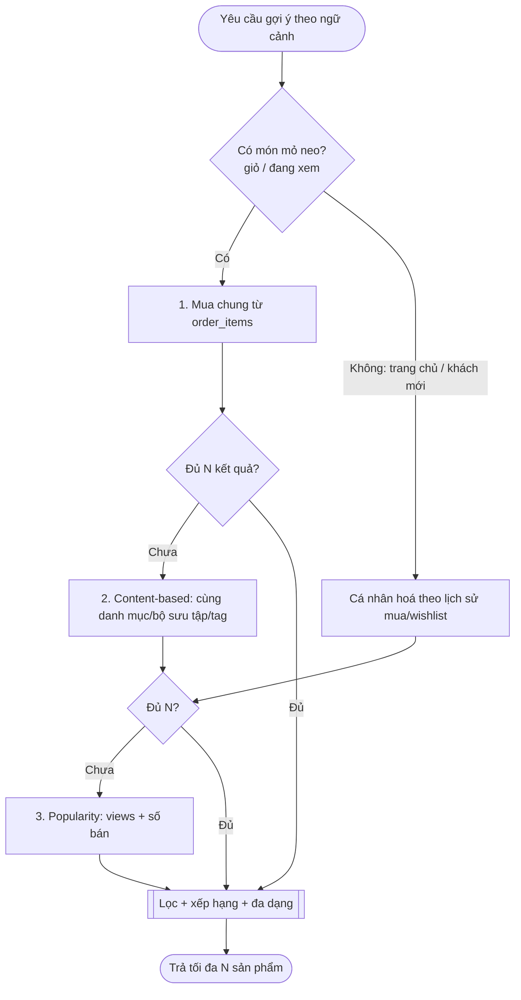

# 08 — Thiết kế hệ Gợi ý sản phẩm (M-35)

> Thiết kế tính năng gợi ý "riêng" thay cho bản tạm (đang lấy danh sách sản phẩm nổi bật trừ hàng trong giỏ).
> Bám dữ liệu THỰC CÓ của Declay. Ngày lập: 2026-08-05. Trạng thái: **DRAFT — chờ chốt §16.**

---

## 0. Bối cảnh & hiện trạng

Component `RecommendedProducts` (M-35) hiện gọi `productsApi.list({ sort: 'popular' })` rồi loại hàng trong giỏ — **không cá nhân hoá, không liên quan ngữ cảnh**. Ai vào cũng thấy cùng một nhóm sản phẩm nổi bật. Đây là *baseline* hợp lý nhưng không tận dụng được dữ liệu hành vi đang có.

## 1. Mục tiêu

Đưa ra gợi ý **liên quan hơn** theo **ngữ cảnh** (đang xem sản phẩm gì, trong giỏ có gì, đã mua gì) để tăng **thêm vào giỏ** và **giá trị đơn**, mà **không over-engineer** (Declay là cửa hàng handmade, catalog nhỏ — vài chục đến vài trăm SKU — không cần ML nặng).

## 2. Nguồn dữ liệu hiện có (khảo sát code)

| Nguồn | Có gì | Dùng cho |
|---|---|---|
| `order_items` | variant_id, số lượng, giá tại thời điểm mua | **Mua chung** (co-occurrence), mua lại |
| `orders` (theo user) | lịch sử mua của khách đăng nhập | Cá nhân hoá theo lịch sử mua |
| `wishlists` | user → variant yêu thích | Tín hiệu sở thích |
| `products.views` | **bộ đếm TỔNG** lượt xem/sản phẩm | Độ phổ biến (fallback) |
| `products`: `categoryId`, `collectionId`, `tags` | thuộc tính nội dung | **Content-based** (cùng danh mục/bộ sưu tập/tag) |
| `product_variants`: stock, isActive, price, campaign | tồn kho, giá | Lọc còn hàng, đa dạng giá |

### 2.1 Hạn chế dữ liệu (quan trọng)

- **KHÔNG có sự kiện xem theo từng người** — `product_views` chỉ là con số tổng trên `products`. Vì vậy **gợi ý theo hành vi DUYỆT của khách chưa làm được** nếu không thêm bảng `product_view_events`. (Xem P-Q2, roadmap Phase 2.)
- Khách **vãng lai** không có lịch sử mua gắn với tài khoản (chỉ có giỏ hiện tại) → với họ chỉ dùng được tín hiệu **ngữ cảnh** (giỏ/sản phẩm đang xem), không cá nhân hoá theo lịch sử.

## 3. Các chiến lược & đánh đổi

| Chiến lược | Dữ liệu cần | Mạnh | Yếu |
|---|---|---|---|
| **Content-based** (cùng danh mục/bộ sưu tập/tag với món "mỏ neo") | đã có | Luôn có kết quả, hợp trang chi tiết/giỏ, không cần lịch sử | Không cá nhân hoá; dễ "na ná" |
| **Co-occurrence** (mua/thêm giỏ chung) | `order_items` | "Thường mua cùng" rất thuyết phục, dữ liệu sẵn | Cần đủ đơn để có tín hiệu; đồ handmade độc bản ít lặp |
| **Popularity** (views + số bán) | đã có | Fallback chắc chắn | Không liên quan, ai cũng giống nhau |
| **Cá nhân hoá theo lịch sử mua/wishlist** | `orders`, `wishlists` | Cá nhân hoá thật cho khách đăng nhập | Không dùng được cho vãng lai; "cold start" khách mới |
| **Behavioral (theo duyệt)** | **thiếu** `product_view_events` | Tín hiệu mạnh nhất | Chưa có dữ liệu → Phase 2 |

## 4. Phương án đề xuất — Hybrid rule-based, phân tầng

Không dùng ML. Dùng **luật + trộn tín hiệu**, tính rẻ, cache lại. Mỗi ngữ cảnh có một **chuỗi ưu tiên** với **fallback** để LUÔN có kết quả:

**Trộn điểm** khi có nhiều nguồn: điểm cuối = `w1·coPurchase + w2·contentSim + w3·popularity + w4·personalAffinity` (trọng số cấu hình được). Giai đoạn đầu có thể chỉ dùng chuỗi fallback đơn giản, thêm trộn điểm sau.

## 5. Ngữ cảnh & vị trí hiển thị

| Ngữ cảnh | Mỏ neo | Chiến lược chính | Tiêu đề |
|---|---|---|---|
| Trang chi tiết sản phẩm | sản phẩm đang xem | co-occurrence → content-based | "Sản phẩm liên quan" |
| **Giỏ hàng** | các món trong giỏ | co-occurrence(giỏ) → content-based → cá nhân hoá | "Có thể bạn sẽ thích" |
| Sau đặt hàng (thank-you) | vừa mua | co-occurrence → popularity | "Mua kèm" |
| Trang chủ / tài khoản | (không) | cá nhân hoá → popularity | "Gợi ý cho bạn" |

## 6. Data Dictionary (bảng mới)

### 6.1 `product_cooccurrence` (Phase 1) — cặp sản phẩm hay mua chung

| Cột | Kiểu | Ghi chú |
|---|---|---|
| product_id | INT FK→products | |
| co_product_id | INT FK→products | |
| score | NUMERIC | số đơn xuất hiện cùng (hoặc lift chuẩn hoá) |
| updated_at | TIMESTAMPTZ | |

Khoá chính (product_id, co_product_id). **Do một job nền dựng lại định kỳ** từ `order_items` — không tính trong luồng request. Catalog nhỏ nên bảng này rất gọn.

### 6.2 `product_view_events` (Phase 2 — TÙY CHỌN, cho gợi ý theo duyệt)

| Cột | Kiểu | Ghi chú |
|---|---|---|
| id | BIGSERIAL | |
| user_id | INT null | null nếu vãng lai |
| session_id | VARCHAR null | giỏ/phiên vãng lai |
| product_id | INT FK→products | |
| viewed_at | TIMESTAMPTZ | |

Chỉ thêm khi quyết định làm cá nhân hoá theo hành vi duyệt (P-Q2). Cần chú ý **riêng tư/PDPA** (xem §12).

## 7. API

`GET /products/recommendations` — một endpoint, tham số ngữ cảnh:

| Tham số | Ý nghĩa |
|---|---|
| `context` | `detail` \| `cart` \| `post_purchase` \| `home` |
| `productId` / `productIds` | món mỏ neo (chi tiết / giỏ / vừa mua) |
| `limit` | mặc định 4 |
| (token) | nếu đăng nhập → thêm tín hiệu cá nhân hoá |

Trả về `Product[]` (đúng shape trang đang dùng cho `ProductCard`, nên FE gần như không đổi — chỉ đổi nguồn gọi từ `productsApi.list` sang endpoint này).

## 8. Business Rules (lọc & xếp hạng)

| ID | Luật |
|---|---|
| BR-1 | **Loại hàng không khả dụng**: bỏ sản phẩm hết hàng (mọi variant stock 0) hoặc `isActive=false`. |
| BR-2 | **Không tự gợi lại**: bỏ chính món mỏ neo và các món đã có trong giỏ. |
| BR-3 | **Không gợi món vừa mua** (ngữ cảnh post_purchase/cart): bỏ sản phẩm khách đã mua gần đây (trừ hàng tiêu hao — xem P-Q3). |
| BR-4 | **Đa dạng**: tối đa ~2 sản phẩm cùng một danh mục trong một khối, tránh 4 món na ná. |
| BR-5 | **Fallback bắt buộc**: nếu sau lọc chưa đủ `limit`, bù bằng tầng kế (content → popularity) để luôn đủ số. |
| BR-6 | **Tôn trọng khuyến mãi/tồn**: ưu tiên nhẹ món đang giảm giá/còn hàng nhiều (tuỳ chọn, cấu hình được). |
| BR-7 | **Ngưỡng tin cậy co-occurrence**: chỉ dùng cặp mua-chung khi score ≥ ngưỡng (vd ≥ 2 đơn) để tránh nhiễu từ đơn lẻ. |

## 9. Job nền tính co-occurrence

- BullMQ repeatable (như job M-27), chạy vd mỗi 6–24h.
- Quét `order_items`, đếm số đơn mà cặp (product_a, product_b) cùng xuất hiện, ghi vào `product_cooccurrence` (chuẩn hoá lift nếu muốn).
- Rẻ vì catalog nhỏ; không đụng luồng request.

## 10. Edge cases

1. **Cửa hàng mới / ít đơn** → co-occurrence rỗng → tự rơi về content-based/popularity (BR-5). Không bao giờ trả rỗng khi còn hàng để bán.
2. **Khách vãng lai** → không có lịch sử → chỉ dùng ngữ cảnh (giỏ/đang xem) + popularity.
3. **Hàng handmade độc bản** (số lượng 1, bán xong hết) → co-occurrence trỏ tới món đã hết → BR-1 loại, fallback bù.
4. **Món mỏ neo là quà/đồ tiêu hao** → có nên gợi lại chính nó không? (P-Q3).
5. **Danh mục quá hẹp** → content-based ít kết quả → fallback popularity.
6. **Giỏ nhiều món khác danh mục** → co-occurrence theo TỪNG món rồi hợp nhất + đa dạng (BR-4).

## 11. Dependencies

- `product_cooccurrence` + migration; job nền.
- Endpoint `GET /products/recommendations` (service ghép các nguồn + áp BR).
- FE: `RecommendedProducts` đổi nguồn gọi sang endpoint (giữ nguyên `ProductCard`); truyền `context` + `productId(s)`.
- (Phase 2) `product_view_events` + ghi sự kiện xem ở FE + cân nhắc PDPA.

## 12. Impact

- **Hiệu năng**: gợi ý đọc từ bảng co-occurrence + truy vấn content nhẹ; cache theo (context, anchor) vài phút. Không nặng.
- **Riêng tư (PDPA)**: Phase 1 chỉ dùng dữ liệu giao dịch đã có (không thêm thu thập). Phase 2 (view events) là **thu thập hành vi mới** → cần rà chính sách riêng tư/consent.
- **Nội dung/vận hành**: gợi ý sai (hết hàng, không liên quan) ảnh hưởng trải nghiệm → BR-1..7 giảm thiểu; cần theo dõi metric (§14).
- **Tương thích**: không phá gì hiện có; `RecommendedProducts` chỉ đổi nguồn dữ liệu.

## 13. Metrics đánh giá

- **CTR** khối gợi ý (click / hiển thị).
- **Add-to-cart rate** từ gợi ý.
- **Đóng góp doanh thu** của sản phẩm đến từ khối gợi ý.
- So sánh **A/B** với baseline "popularity" hiện tại trước khi thay hẳn.

## 14. Rủi ro & giảm thiểu

| Rủi ro | Giảm thiểu |
|---|---|
| Ít dữ liệu → gợi ý nhạt | Fallback phân tầng; đặt kỳ vọng đúng (catalog nhỏ) |
| Gợi ý hàng đã hết | BR-1 lọc tồn kho ở thời điểm truy vấn (không tin cache tồn) |
| Over-engineer | Bắt đầu bằng luật + co-occurrence; **không** ML cho tới khi có bằng chứng cần |
| Riêng tư (Phase 2) | Chỉ làm view-tracking sau khi rà PDPA + consent |

## 15. UAT (rút gọn)

| ID | Kịch bản | Kỳ vọng |
|---|---|---|
| UAT-1 | Trang chi tiết SP A (có cặp mua-chung B, C) | Gợi ý gồm B, C; không gồm A; không gồm hàng hết |
| UAT-2 | Giỏ có A, B | Gợi ý liên quan A/B, **không** gồm A, B |
| UAT-3 | Cửa hàng chưa có đơn nào | Vẫn hiển thị (content-based/popularity), không rỗng |
| UAT-4 | Khách đăng nhập từng mua danh mục X | Trang chủ "Gợi ý cho bạn" nghiêng về X |
| UAT-5 | Tất cả ứng viên gợi ý đều hết hàng | Bù bằng fallback còn hàng; không hiện hàng hết |
| UAT-6 | Khách vãng lai | Có gợi ý theo ngữ cảnh, không lỗi, không cá nhân hoá |

## 16. Câu hỏi cần xác nhận (chặn thiết kế chi tiết)

- **P-Q1** — Ưu tiên ngữ cảnh nào làm TRƯỚC? (đề xuất: **Giỏ hàng** — nơi đã có khối, và **Trang chi tiết** — nơi tác động mua cao nhất.)
- **P-Q2** — Có làm **cá nhân hoá theo hành vi DUYỆT** không (cần thêm `product_view_events` + rà PDPA)? Hay Phase 1 chỉ dùng giao dịch (mua/wishlist/ngữ cảnh)?
- **P-Q3** — Có gợi lại **món đã mua/đang có trong giỏ** cho hàng **tiêu hao/mua lại** không, hay luôn loại?
- **P-Q4** — Chấp nhận **rule-based hybrid** (không ML) cho quy mô hiện tại chứ?
- **P-Q5** — Nhịp chạy job co-occurrence (6h / 24h)? Ngưỡng tin cậy tối thiểu (số đơn) bao nhiêu?

## 17. Roadmap phân giai đoạn

| Giai đoạn | Nội dung | Phụ thuộc |
|---|---|---|
| **M-35a** ✅ | Migration 030 (`product_cooccurrence` + `product_view_events`); entity; hàm thuần `buildCooccurrence` (test) + job nền 24h dựng từ `order_items` (ngưỡng ≥2) | — |
| **M-35b** ✅ | `RecommendationService` (co-occurrence → content-based → popularity, BR-1..4 + loại đã-mua BR-3) + `GET /products/recommendations` + `POST /products/view` | M-35a |
| **M-35c** ✅ | FE: `recommendationsApi`; `RecommendedProducts` theo `context`; giỏ dùng `context=cart`; trang chi tiết SP dùng engine (`RelatedProducts`) + ghi view | M-35b |
| **M-35d** | Cá nhân hoá theo lịch sử mua/wishlist cho khách đăng nhập (trang chủ/tài khoản) | M-35b |
| **M-35e** *(tuỳ chọn)* | `product_view_events` + tracking + gợi ý theo duyệt (sau khi rà PDPA) | rà PDPA |
| **M-35f** | Đo metric + A/B với baseline popularity; tinh chỉnh trọng số | tất cả |

> Không bắt đầu M-35a cho tới khi §16 được chốt — đặc biệt P-Q2 (view-tracking + PDPA) và P-Q4 (đồng ý rule-based, không ML).
