# 04 — Quy trình & Vòng đời Đơn hàng (Order Process & Lifecycle)

**Ngày:** 2026-07-17 · **Trạng thái:** Vòng 5 xong.
**Liên quan:** `03-scope-and-mvp.md`

---

## 1. Chốt từ khách (vòng 5)
| Chủ đề | Chốt | Hàm ý thiết kế |
|---|---|---|
| Nguồn hàng | **Luôn có sẵn (có tồn kho)** | Cần **quản lý tồn kho**; **không** cần trạng thái "đang sản xuất" |
| Xác nhận đơn | **Tự động vào xử lý** | Không có bước "confirm" thủ công; đơn → processing ngay |
| Bàn giao hãng | **Tuỳ lúc** (pickup hoặc tự mang) | Không cứng hoá trong hệ thống; chỉ cần đánh dấu `shipped` khi đã bàn giao + có mã vận đơn |
| Huỷ / đổi-trả | **Cho huỷ trước khi gửi** + **cho đổi-trả vài ngày** | Cần state `cancelled` (trước ship) và luồng `returned` (sau giao, trong X ngày) |

## 2. Vòng đời đơn (to-be, MVP)

```mermaid
stateDiagram-v2
  [*] --> pending_payment: VNPay (trả trước)
  [*] --> processing: COD (tự động vào xử lý)
  pending_payment --> processing: Thanh toán thành công
  pending_payment --> cancelled: Hết hạn giữ chỗ / huỷ
  processing --> shipped: Bàn giao hãng + nhập mã vận đơn
  processing --> cancelled: Huỷ trước khi gửi (hoàn tồn; refund nếu đã trả)
  shipped --> delivered: Giao thành công (COD: đã thu tiền)
  delivered --> returned: Đổi-trả trong X ngày
  delivered --> [*]
  cancelled --> [*]
  returned --> [*]
```

## 3. Bảng trạng thái
| Trạng thái | Nghĩa | Vào từ | Ai chuyển tiếp | Điều kiện |
|---|---|---|---|---|
| `pending_payment` | Chờ thanh toán (chỉ VNPay/trả trước) | Đặt đơn trả trước | Hệ thống (webhook) | Có xác nhận thanh toán |
| `processing` | Đã nhận đơn, đang chuẩn bị/đóng gói | COD (ngay) hoặc sau khi paid | Staff/Admin | — |
| `shipped` | Đã bàn giao hãng | processing | **Staff/Admin** (bắt buộc nhập **mã vận đơn**) | Đã có mã tracking |
| `delivered` | Giao thành công (COD = đã thu tiền) | shipped | Hệ thống (GHN/GHTK) hoặc Staff | Xác nhận từ hãng / thủ công |
| `cancelled` | Huỷ trước khi gửi | pending_payment / processing | Staff/Admin (hoặc khách khi chưa ship) | **Chỉ khi chưa `shipped`** |
| `returned` | Đổi-trả sau giao | delivered | Staff/Admin | Trong **X ngày** sau delivered |

## 4. Business rules (MVP)
- **BR-01 Tồn kho:** hàng luôn có sẵn → **giữ chỗ (reserve) khi đặt**, **trừ tồn khi xác nhận đơn**, **hoàn tồn khi `cancelled`**. Không cho đặt quá tồn (chống oversell).
- **BR-02 Tự động xử lý:** đơn COD vào `processing` ngay; đơn VNPay vào `processing` khi `paid`.
- **BR-03 Ship cần mã vận đơn:** không cho chuyển `shipped` nếu thiếu mã tracking (khớp quyết định bàn giao "tuỳ lúc" — hệ thống chỉ cần bằng chứng đã gửi).
- **BR-04 Huỷ:** chỉ cho huỷ khi **chưa `shipped`**; nếu đã trả trước (VNPay) → **hoàn tiền**; COD → không phát sinh tiền.
- **BR-05 Đổi-trả:** cho tạo yêu cầu `returned` trong **X ngày** sau `delivered` (X cần chốt — mặc định đề xuất **7 ngày**).
- **BR-06 COD:** thu tiền khi giao; cần **đối soát** tiền hãng thu hộ với đơn `delivered`.
- **BR-07 Trạng thái tiến, không lùi:** không quay ngược trạng thái (trừ đường huỷ/đổi-trả hợp lệ).

## 5. Phân vai hành động (Admin ↔ Staff)
| Hành động | Staff | Admin |
|---|:--:|:--:|
| Xem/ tìm đơn | ✅ | ✅ |
| Chuyển `processing→shipped` (nhập mã) | ✅ | ✅ |
| Đánh dấu `delivered` | ✅ | ✅ |
| Huỷ đơn (trước ship) | ✅ | ✅ |
| Duyệt đổi-trả / hoàn tiền | ⚠️ (giới hạn) | ✅ |
| Sửa giá / cấu hình / xoá | ❌ | ✅ |
| Xem báo cáo doanh số | ⚠️ (cơ bản) | ✅ |

## 6. Nhận định & rủi ro (BA)
- **COD tự động xử lý (không gọi xác nhận) → rủi ro "bom hàng"** cao ở VN. Đề xuất tuỳ chọn: staff có thể huỷ nhanh đơn nghi ngờ; hoặc bật "gọi xác nhận đơn COD > mức tiền X" ở giai đoạn sau.
- **Cần chốt `X` ngày đổi-trả** để hiện chính sách rõ ở checkout (đề xuất 7 ngày).
- **Đối soát COD** là việc thủ công nhỏ nhưng dễ sai — cần màn hình "đơn delivered chưa đối soát tiền".
- Trạng thái này **khớp phần lõi đã có** trong bản cũ (pending_payment/paid/processing/shipped/delivered/cancelled) → tái dùng, chỉ thêm nhánh `returned` + luồng COD.

## 7. Câu hỏi còn mở (sang vòng 6 — Dữ liệu sản phẩm)
1. Chốt **X ngày** đổi-trả.
2. Sản phẩm cần **thuộc tính/biến thể** gì (kích thước, màu, phiên bản…), quản lý **tồn kho theo biến thể**?
3. Giá: một giá hay có **giá KM/giảm giá** ở MVP?
4. Có cần **giá vốn** (để tính lãi / ẩn với Staff) không?
