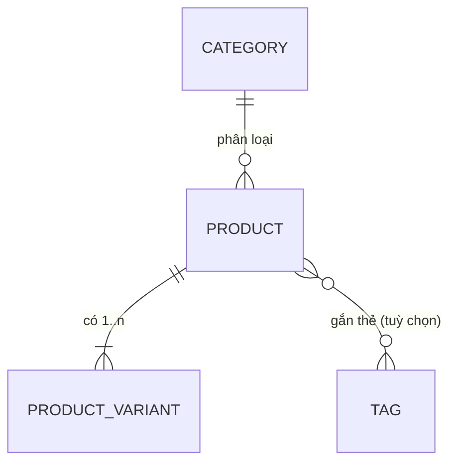

# 05 — Dữ liệu Sản phẩm (Product Data Dictionary)

**Ngày:** 2026-07-17 · **Trạng thái:** Vòng 6 xong.
**Liên quan:** `04-order-process-and-lifecycle.md`

---

## 1. Chốt từ khách (vòng 6)
| Chủ đề | Chốt | Hàm ý |
|---|---|---|
| Biến thể | **Tuỳ sản phẩm** | Product có **1..n biến thể**; sản phẩm "1 mẫu" = 1 biến thể mặc định |
| Tồn kho | **Theo từng biến thể** | `stock` nằm ở **variant** |
| Giá | **Giá gốc + giá khuyến mãi** | `price` + `special_price` ở variant (đã có ở bản cũ) + mã giảm giá ở checkout |
| Giá vốn | **Có — tính lãi, ẩn với Staff** | `cost_price` ở variant, **chỉ Admin**; tính `margin` |

## 2. Sơ đồ thực thể (ERD)

## 3. Data dictionary

### PRODUCT (sản phẩm)
| Trường | Kiểu | Bắt buộc | Ghi chú |
|---|---|:--:|---|
| id | int (PK) | ✅ | |
| name | string(150) | ✅ | Tên hiển thị |
| slug | string, unique | ✅ | URL thân thiện + share |
| description | text | ➖ | Mô tả/câu chuyện sản phẩm (điểm bán của handmade) |
| category_id | int (FK) | ➖ | Phân loại |
| material | string | ➖ | Chất liệu (đặc thù handmade) |
| is_active | bool | ✅ | Ẩn/hiện trên storefront |
| views | int | ✅ | Đếm lượt xem (phục vụ báo cáo bán chạy) |
| created_at / updated_at | timestamp | ✅ | |

### PRODUCT_VARIANT (biến thể — nơi giữ giá & tồn)
| Trường | Kiểu | Bắt buộc | Ghi chú |
|---|---|:--:|---|
| id | int (PK) | ✅ | |
| product_id | int (FK) | ✅ | |
| name | string(120) | ✅ | VD "Size M / Đỏ"; SP 1 mẫu = "Mặc định" |
| sku | string, unique | ➖ | Mã hàng (đối chiếu báo cáo per-SKU) |
| **price** | decimal(10,2) | ✅ | **Giá gốc** |
| **special_price** | decimal(10,2) | ➖ | **Giá KM** (nếu có, < price) |
| **cost_price** | decimal(10,2) | ➖ | **Giá vốn — CHỈ ADMIN**, tính lãi |
| **stock** | int | ✅ | **Tồn theo biến thể** (≥ 0) |
| weight_gram | int | ➖ | **Cần cho tính phí GHN/GHTK** (đề xuất bắt buộc khi bật ship tự động) |
| length/width/height_cm | int | ➖ | Kích thước kiện — phí ship theo thể tích |
| images | string[] | ➖ | Ảnh (Cloudinary) — ảnh đẹp là điểm bán |
| is_active | bool | ✅ | |

### CATEGORY (danh mục)
| Trường | Kiểu | Bắt buộc | Ghi chú |
|---|---|:--:|---|
| id | int (PK) | ✅ | |
| name | string | ✅ | |
| slug | string, unique | ✅ | |

### (Tuỳ chọn) TAG — gắn thẻ lọc/tìm. Hoãn nếu không cần ở MVP.

## 4. Trường tính toán / báo cáo (không lưu thô)
- **margin** = `price − cost_price` (và % lãi) — **chỉ Admin**.
- **effective_price** = min(price, special_price) — giá khách thực trả (đã có helper ở bản cũ).
- **Per-SKU metrics** (báo cáo bán chạy): lượt xem, số lần thêm giỏ, số lượng bán, doanh thu — tổng hợp từ order_items + views. *Đây là công cụ kiểm chứng cốt lõi.*

## 5. Nhận định & rủi ro (BA)
- **`cost_price` + `margin` phải ẩn với Staff** (khớp phân quyền vòng 5) → API không trả 2 trường này cho token Staff.
- **`weight`/kích thước cần cho phí ship GHN/GHTK**: nếu bật ship tự động mà thiếu cân nặng → không tính được cước. Đề xuất **bắt buộc weight khi tạo biến thể** (hoặc đặt mặc định theo loại).
- **Tồn theo biến thể** khớp luồng giữ-chỗ/chống-oversell ở vòng 5 (BR-01).
- **Giá gốc + KM** khớp `special_price` sẵn có → tái dùng; mã giảm giá là lớp riêng ở checkout.
- Bản cũ đã có Product/Variant/Category/Images/price/special_price/stock → **NEW cần thêm: `cost_price` (admin-only), `weight`/kích thước, và báo cáo per-SKU**.

## 6. Câu hỏi còn mở (sang vòng 7 — Con số, phi chức năng & ràng buộc)
1. **Con số tiêu chí thành công** (đơn/doanh thu/ngưỡng "bán chạy") + **X ngày đổi-trả** (đề xuất 7).
2. **Ngân sách & thời gian** thực tế (khẳng định mốc 1 tháng).
3. **Phi chức năng**: tải kỳ vọng, ngôn ngữ (VN/EN), thiết bị chính (mobile), SEO/OG cho social.
4. **Pháp lý/thuế** khi bán ở VN (hoá đơn?), và dữ liệu cá nhân khách (địa chỉ, SĐT).
