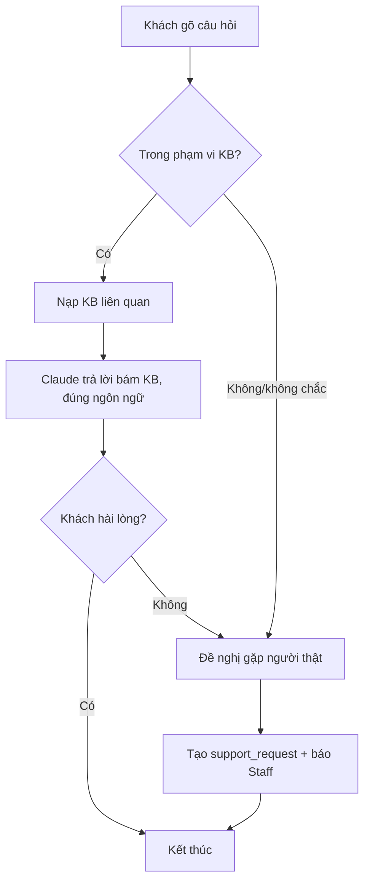
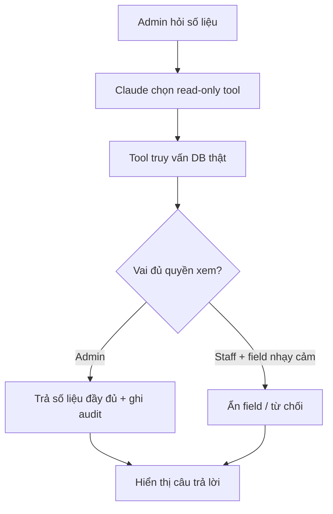
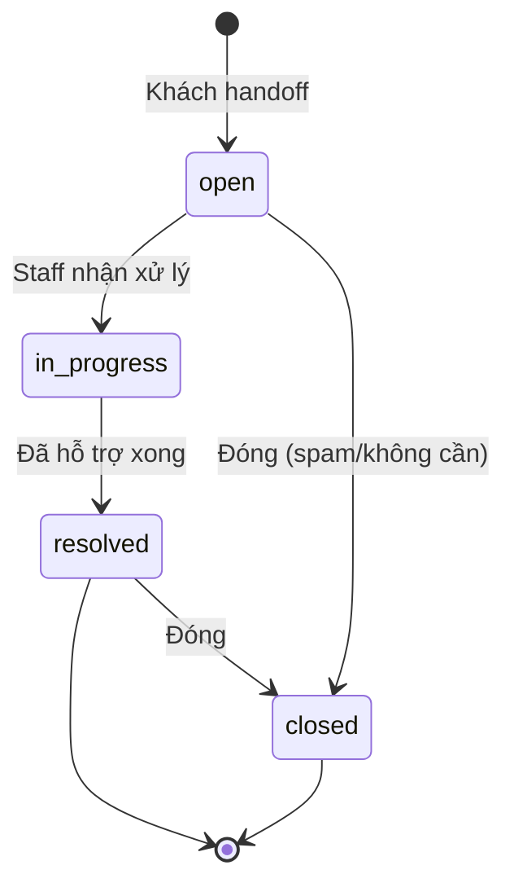

# 09 — Thiết kế Phase A: Chatbot (khách) & AI Assistant (admin)

**Ngày:** 2026-07-17 · **Phạm vi:** CHỈ Phase A (không có hành động ghi của AI).
**Liên quan:** `07-feature-chatbot-ai-assistant.md`, `08-phase-a-implementation-plan.md`

---

## 1. Bối cảnh & phạm vi thiết kế
Thiết kế cho **Phase A**: (a) Chatbot khách trả lời **FAQ/chính sách** song ngữ + **chuyển người thật**; (b) AI Assistant admin **hỏi số liệu (chỉ đọc)** + **soạn nội dung (nháp)**. LLM: **Claude Haiku**. Không có tool ghi.

---

## 2. Danh sách Use Case
| ID | Use case | Actor chính |
|---|---|---|
| UC-01 | Hỏi FAQ/chính sách qua chatbot | Khách (guest/đăng nhập) |
| UC-02 | Yêu cầu gặp người thật (handoff) | Khách |
| UC-03 | Xử lý yêu cầu hỗ trợ (hàng chờ) | Staff |
| UC-04 | Hỏi số liệu vận hành qua AI | Admin |
| UC-05 | Nhờ AI soạn nội dung (nháp) | Admin |
| UC-06 | Quản lý kho tri thức FAQ (song ngữ) | Admin |

### UC-01 (chi tiết) — Hỏi FAQ/chính sách
- **Tiền điều kiện:** widget mở; KB có nội dung.
- **Luồng chính:** Khách gõ câu hỏi → hệ thống nạp KB liên quan vào ngữ cảnh → Claude trả lời **bám KB**, đúng ngôn ngữ khách.
- **Luồng phụ:** ngoài phạm vi KB / không chắc → đề nghị **handoff** (UC-02).
- **Hậu điều kiện:** hội thoại được lưu (tuỳ chọn); có thể phát sinh support_request.

### UC-04 (chi tiết) — Hỏi số liệu
- **Tiền điều kiện:** đăng nhập admin.
- **Luồng chính:** Admin hỏi ("doanh thu tuần này?", "Top SKU?") → Claude **gọi read-only tool** truy vấn DB → dữ liệu **lọc theo quyền** → trả lời + số liệu.
- **Ngoại lệ:** Staff hỏi số nhạy cảm → **từ chối** (BR-08).

---

## 3. BPMN / Activity flows

### 3.1 Chatbot khách (FAQ + handoff)

### 3.2 AI admin hỏi số liệu (read-only)

---

## 4. Business Rules (Phase A)
| ID | Rule |
|---|---|
| BR-01 | Chatbot **chỉ trả lời bám kho tri thức**; ngoài phạm vi → đề nghị handoff, không bịa. |
| BR-02 | Chatbot **tự nhận ngôn ngữ** (VN/EN) và trả lời tương ứng. |
| BR-03 | **Ẩn dữ liệu nhạy cảm** (giá vốn, margin, PII, đơn người khác) khỏi mọi câu trả lời cho khách. |
| BR-04 | **AI KHÔNG thực hiện hành động ghi** ở Phase A (chỉ đọc + xuất nháp). |
| BR-05 | **Rate-limit** per-session/per-admin + **trần ngân sách tháng**; vượt → chatbot chuyển người thật, AI admin tạm khoá. |
| BR-06 | **Audit** mọi tool đọc nhạy cảm của AI admin (actor, tool, thời gian). |
| BR-07 | Handoff luôn tạo **support_request** trạng thái `open` + thông báo Staff. |
| BR-08 | **Staff không xem** số nhạy cảm (giá vốn/margin/lợi nhuận) qua AI; chỉ Admin. |
| BR-09 | Số liệu AI trả về phải **truy vấn thật từ DB**, không suy đoán. |

---

## 5. Data Dictionary (mới)

### faqs (kho tri thức song ngữ)
| Trường | Kiểu | BB | Ghi chú |
|---|---|:--:|---|
| id | int PK | ✅ | |
| question_vi / answer_vi | text | ✅ | Nội dung tiếng Việt |
| question_en / answer_en | text | ➖ | Tiếng Anh (có thể để AI soạn nháp) |
| tags | string[] | ➖ | Từ khoá để truy hồi |
| is_active | bool | ✅ | |
| created_at / updated_at | timestamp | ✅ | |

### support_requests (handoff)
| Trường | Kiểu | BB | Ghi chú |
|---|---|:--:|---|
| id | int PK | ✅ | |
| user_id | int FK | ➖ | Null nếu guest |
| session | string | ✅ | Định danh phiên chat |
| message | text | ✅ | Câu hỏi/ngữ cảnh cần hỗ trợ |
| status | enum(open, in_progress, resolved, closed) | ✅ | |
| handled_by | int FK admin | ➖ | Staff/Admin xử lý |
| created_at / updated_at | timestamp | ✅ | |

### assistant_audit (đọc nhạy cảm)
| Trường | Kiểu | BB | Ghi chú |
|---|---|:--:|---|
| id | int PK | ✅ | |
| admin_id | int FK | ✅ | Ai gọi |
| tool | string | ✅ | Tên tool đọc |
| params | jsonb | ➖ | Tham số |
| created_at | timestamp | ✅ | |

### ai_usage (kiểm soát chi phí)
| Trường | Kiểu | BB | Ghi chú |
|---|---|:--:|---|
| id | int PK | ✅ | |
| scope | enum(chat, admin_assistant) | ✅ | |
| tokens_in / tokens_out | int | ✅ | Đếm token |
| cost_usd | decimal | ✅ | Ước tính chi phí |
| period | string (YYYY-MM) | ✅ | Cộng dồn theo tháng để so trần |
| created_at | timestamp | ✅ | |

---

## 6. State Diagram — support_request

---

## 7. Permission Matrix
| Hành động | Guest | Khách (login) | Staff | Admin |
|---|:--:|:--:|:--:|:--:|
| Chat FAQ (chatbot) | ✅ | ✅ | ✅ | ✅ |
| Tạo handoff/support_request | ✅ | ✅ | — | — |
| Xem & xử lý hàng chờ hỗ trợ | ❌ | ❌ | ✅ | ✅ |
| AI hỏi số liệu **không** nhạy cảm (đơn/tồn/Top-SKU) | ❌ | ❌ | ✅ | ✅ |
| AI hỏi số liệu **nhạy cảm** (giá vốn/margin/lợi nhuận) | ❌ | ❌ | ❌ | ✅ |
| AI soạn nội dung (nháp) | ❌ | ❌ | ⚠️ (tuỳ) | ✅ |
| Quản lý FAQ (KB) | ❌ | ❌ | ❌ | ✅ |
| Bất kỳ hành động ghi qua AI | ❌ | ❌ | ❌ | ❌ (Phase A) |

---

## 8. Thiết kế API (Phase A)
| Method · Endpoint | Vai | Mô tả |
|---|---|---|
| POST `/api/chat` | public | Gửi tin nhắn khách → trả lời FAQ (Claude + KB) |
| POST `/api/chat/handoff` | public | Tạo support_request (BR-07) |
| GET `/api/admin/support-requests` | Staff/Admin | Danh sách hàng chờ |
| PUT `/api/admin/support-requests/:id` | Staff/Admin | Cập nhật trạng thái |
| GET/POST/PUT/DELETE `/api/admin/faqs` | Admin | CRUD kho tri thức song ngữ |
| POST `/api/admin/assistant` | Admin (Staff giới hạn) | Hỏi số liệu (read-only tools) + soạn nội dung nháp |

**Read-only tools (AI admin):** `get_sales_summary(period)`, `get_top_skus(period, limit)`, `get_low_stock(threshold)`, `get_order_count(period, status?)` — mỗi tool lọc field theo vai (BR-03/BR-08) và ghi `assistant_audit` (BR-06).

---

## 9. UAT Scenarios (Given / When / Then)
- **UAT-01 (FAQ):** *Given* KB có mục "đổi-trả 7 ngày" *When* khách hỏi "đổi hàng được không?" *Then* bot trả đúng chính sách 7 ngày, đúng ngôn ngữ hỏi.
- **UAT-02 (Grounding):** *Given* câu hỏi ngoài KB ("bảo hành mấy năm?") *When* hỏi *Then* bot **không bịa**, đề nghị gặp người thật.
- **UAT-03 (Ngôn ngữ):** *When* khách hỏi bằng tiếng Anh *Then* bot trả lời tiếng Anh.
- **UAT-04 (Handoff):** *When* khách bấm "gặp người thật" *Then* tạo support_request `open` + Staff nhận thông báo.
- **UAT-05 (Hàng chờ):** *Given* support_request `open` *When* Staff nhận *Then* chuyển `in_progress`; xong → `resolved`.
- **UAT-06 (Số liệu):** *Given* admin đăng nhập *When* hỏi "Top 5 SKU tháng này" *Then* trả đúng số từ DB + ghi audit.
- **UAT-07 (Ẩn nhạy cảm):** *Given* **Staff** đăng nhập *When* hỏi "lợi nhuận/giá vốn" *Then* **bị từ chối**, không lộ số.
- **UAT-08 (Không ghi):** *When* admin nhờ AI "tạo sản phẩm/giảm giá" *Then* AI **chỉ soạn nháp/khước từ ghi** (Phase A không có tool ghi).
- **UAT-09 (Trần chi phí):** *Given* đã đạt trần ngân sách tháng *When* khách chat *Then* bot chuyển người thật; AI admin tạm khoá.

---

## 10. NFR & guardrail (nhắc lại)
Model rẻ (Claude Haiku) · cache FAQ · rate-limit · **trần ngân sách $/tháng** (BR-05) · audit đọc nhạy cảm (BR-06) · KB & tool lọc theo quyền (BR-03/08). Chi tiết chi phí ở `08`.
