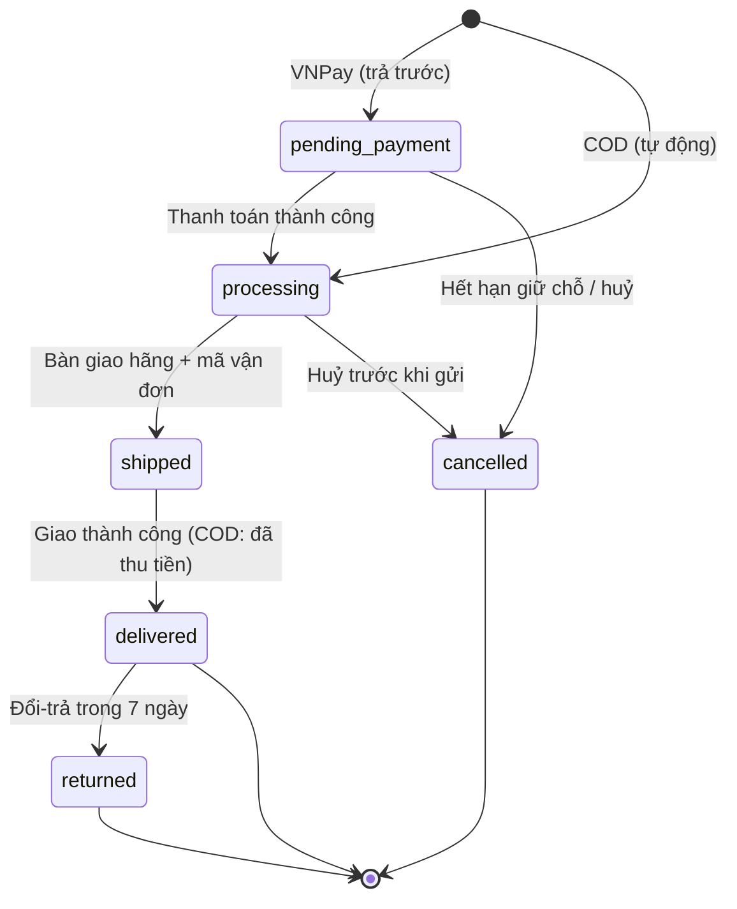
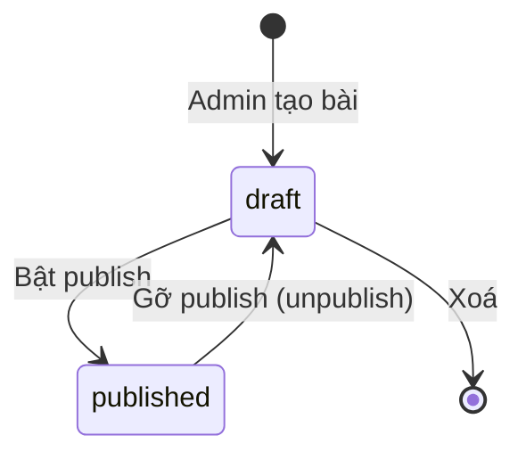
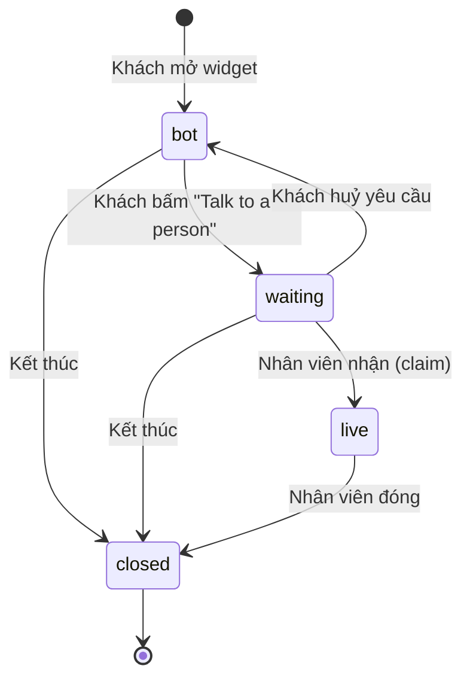
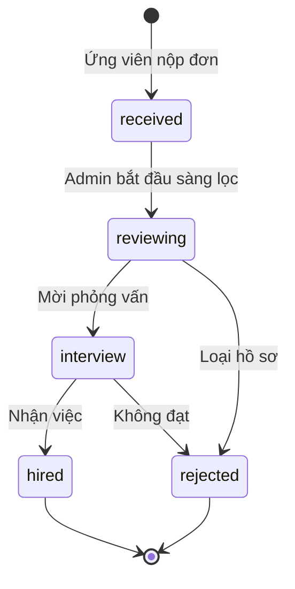

# 10 — MVP: SRS/BRD gọn + Thiết kế (Use Case · Business Rule · State · Permission · UAT)

**Ngày:** 2026-07-17 · **Nguồn:** discovery `00`–`06`.
**Phạm vi:** MVP e-commerce handmade B2C, **VN-trước**, mục tiêu **kiểm chứng "SKU nào bán chạy" trong ~1 tháng**.

---

## PHẦN A — BRD (gọn)

### A1. Bối cảnh & mục tiêu
Website bán **đồ handmade** (B2C), **làm lại từ đầu**. Mục tiêu: **20–50 đơn/tháng** và **xác định Top SKU bán chạy**. Khách từ **mạng xã hội**, **mobile-first**. Vận hành **team (Admin/Staff)**.

### A2. Phạm vi (in / out)
- **IN (MVP):** catalog + biến thể + ảnh, trang SP mobile/OG, giỏ + **guest checkout**, **COD**, quản lý đơn Admin/Staff + nhập mã vận đơn, **báo cáo per-SKU**, trang Điều khoản/Bảo mật, khung song ngữ (VN trước), **Journals (blog/articles)**, **Careers (tuyển dụng + ứng tuyển)**.
- **FAST-FOLLOW:** VNPay, GHN/GHTK tự động, tài khoản khách, review, mã giảm giá, hoá đơn VAT, tiếng Anh, tag bài viết.
- **OUT (nay):** quốc tế, campaign/collection, wishlist, AI/chatbot, RMA đầy đủ, dashboard sâu.

### A3. Giả định & phụ thuộc
- Có **hộ kinh doanh** (mở khoá VNPay + VAT) — lead-time ngoài kiểm soát → **không chặn ra mắt** (COD trước).
- Là **rebuild** → tái dùng phần lõi bản cũ; chỉ thêm: giá vốn (admin), weight/kích thước, báo cáo per-SKU, luồng COD, nhánh returned.
- **Journals + Careers đã có sẵn code** (module `article`, `job`, `job-application`, `upload` + trang `/blog`, `/careers`, `/admin/articles`, `/admin/jobs`) → đưa vào MVP với chi phí gần bằng 0. Việc còn lại chủ yếu là **nội dung** (soạn bài, đăng tin) và **kiểm thử UAT**.
- Thuật ngữ: **"Journals"** là tên thiện danh dùng trong tài liệu & giao diện; trong code tương ứng với `article` / route `/blog` / `/api/articles` — **không đổi code**.

---

## PHẦN B — SRS

### B1. Yêu cầu chức năng (FR)
| ID | Yêu cầu | Ưu tiên |
|---|---|---|
| FR-01 | Xem danh sách SP: lọc danh mục, tìm kiếm, sắp xếp; **mobile-first**, infinite scroll | Must |
| FR-02 | Xem chi tiết SP: biến thể, ảnh, **giá gốc/KM**, mô tả, tồn | Must |
| FR-03 | **OG/share meta** cho trang SP (khách từ social) | Must |
| FR-04 | Thêm/sửa/xoá giỏ hàng | Must |
| FR-05 | **Guest checkout** (mua không cần tài khoản) | Must |
| FR-06 | Nhập địa chỉ + chọn phương thức/ phí vận chuyển | Must |
| FR-07 | Chọn thanh toán: **COD** (Must) · **VNPay** (Fast-follow) | Must/Should |
| FR-08 | Tính tổng: subtotal − giảm + ship; **giá hiệu lực = min(gốc, KM)** | Must |
| FR-09 | Đặt đơn (COD không cần trả trước) | Must |
| FR-10 | Quản lý đơn Admin/Staff: xem, đổi trạng thái, **nhập mã vận đơn** | Must |
| FR-11 | **Báo cáo per-SKU** (views/adds/orders/revenue) + Top SKU | Must |
| FR-12 | CRUD SP/biến thể/ảnh (Cloudinary); giá gốc/KM/**giá vốn (admin)**, **weight/kích thước** | Must |
| FR-13 | Phân quyền **Admin/Staff**; ẩn giá vốn/margin với Staff | Must |
| FR-14 | Trang **Điều khoản + Bảo mật** | Must |
| FR-15 | Khung **song ngữ VN/EN** (dịch VN cho MVP) | Must (VN) |
| FR-16 | **VNPay**: redirect + webhook xác nhận `paid` | Should |
| FR-17 | **GHN/GHTK**: tạo vận đơn + tracking (đầu: nhập mã tay) | Should |
| FR-18 | **Tài khoản khách**: đăng ký/đăng nhập, lịch sử đơn | Should |
| FR-19 | **Review** sản phẩm (chỉ người đã mua) | Should |
| FR-20 | **Mã giảm giá** (ràng buộc hạn dùng + trần số lần) | Should |
| FR-21 | **Đối soát COD** (đơn delivered chưa đối soát tiền) | Should |
| FR-22 | **Hoá đơn VAT** | Should (phụ thuộc đăng ký) |
| **FR-23** | **Journals — công khai:** danh sách bài **đã publish** + chi tiết theo **slug**; **đếm lượt xem**; OG/share meta; cache 10 phút | **Must** |
| **FR-24** | **Journals — Admin:** CRUD bài viết (tiêu đề, nội dung, slug duy nhất, tác giả), **bật/tắt publish**, xem cả bài nháp | **Must** |
| **FR-25** | **Careers — công khai:** danh sách **job đang mở** + chi tiết (mô tả, yêu cầu, địa điểm); **form ứng tuyển** (tên, email, **upload CV**, thư ứng tuyển ≤3000 ký tự) | **Must** |
| **FR-26** | **Careers — Admin:** CRUD tin tuyển dụng (đóng/mở), xem đơn ứng tuyển theo job, **đổi trạng thái ứng viên** | **Must** |
| **FR-27** | **Upload CV công khai** cho ứng viên: `POST /api/careers/cv`, chấp nhận **PDF/DOC/DOCX ≤10MB**, có **rate-limit**, lưu Cloudinary (`declay/cvs`) | **Must** ✅ *(đã build — W-19)* |
| FR-28 | **Tag bài viết** (phân loại Journals) | Could *(module `tag` đã build BE, thiếu FE)* |
| **FR-29** | **Chatbot AI cho khách:** widget storefront, streaming SSE, trả lời sản phẩm/chính sách/vận chuyển bằng **dữ liệu thật** (tool `search_products`); **chỉ đọc**, không đặt/sửa được đơn; rate-limit | **Must** ✅ |
| **FR-30** | **Chatbot tra cứu đơn:** `get_order_status` (theo id) và `list_my_orders` (đơn gần đây) — **chỉ cho khách đã đăng nhập**, giới hạn theo `userId` ở tầng service | **Must** ✅ |
| **FR-31** | **AI Assistant cho Admin:** tool-use loop (tra cứu + tạo/sửa sản phẩm, danh mục, mã giảm, banner), **cổng xác nhận** cho thao tác nguy hiểm (`update_order_status`, `publish_article`, `delete_product`), giới hạn `admin`/`super_admin`, rate-limit | **Must** ✅ |
| **FR-32** | **Chuyển hội thoại cho người:** khách bấm "Talk to a person" → session chuyển `bot → waiting`; **giữ nguyên toàn bộ lịch sử** để nhân viên đọc được ngữ cảnh | **Must** ✅ |
| **FR-33** | **Chat real-time:** nhân viên nhận việc (`claim`) → `live`; tin nhắn hai chiều đẩy qua **SSE + Redis pub/sub**; đóng hội thoại (`closed`) | **Must** ✅ |
| **FR-34** | **Inbox nhân viên** `/admin/inbox`: hàng đợi (chờ trước, chờ lâu nhất trước), badge chưa đọc, thời gian chờ, đọc transcript trước khi nhận | **Must** ✅ |
| **FR-35** | **Guest chat được:** khách chưa đăng nhập vẫn escalate được, định danh bằng `X-Guest-Session` (cùng cơ chế giỏ hàng) | **Must** ✅ |
| **FR-36** | **Ngoài giờ:** không có nhân viên online → tin nhắn vào hàng đợi + **email báo staff** kèm 6 tin gần nhất; khách để email thì nhận email xác nhận | **Must** ✅ |
| **FR-37** | **Presence nhân viên:** heartbeat 30s, TTL 60s trong Redis; quyết định khách có được mời chat với người hay không | **Must** ✅ |
| **FR-39** | **Nút gợi ý sẵn cho chatbot:** 5 nút khởi đầu khi chat trống (Hàng mới · Bán chạy · Phí ship · Thanh toán & COD · Đổi trả) + nút theo ngữ cảnh (Đơn của tôi / Đăng nhập · Đọc chính sách · Gặp nhân viên). Nhãn qua **i18n VN/EN** | **Must** ✅ |
| **FR-40** | **Bot đọc chính sách từ CMS** (`get_policy` → bảng `pages`) thay vì text hardcode, để admin sửa trên dashboard là bot nói theo ngay | **Must** ✅ |
| FR-38 | Typing indicator, gửi ảnh/file, chuyển hội thoại giữa nhân viên, giờ làm việc cấu hình, CSAT | Could |

### B2. Yêu cầu phi chức năng (NFR) — xem chi tiết `06`
Mobile-first · tốc độ · OG/share · song ngữ · bảo mật PII · audit cơ bản · sẵn sàng/sao lưu. Ràng buộc: **~1 tháng**, team 2 vai, phụ thuộc đăng ký (VNPay/VAT), ngân sách chưa chốt.

---

## PHẦN C — Use Case
| ID | Use case | Actor |
|---|---|---|
| UC-01 | Duyệt & tìm sản phẩm | Guest/Khách |
| UC-02 | Xem chi tiết & chọn biến thể | Guest/Khách |
| UC-03 | Quản lý giỏ hàng | Guest/Khách |
| UC-04 | Đặt hàng (guest, COD) | Guest/Khách |
| UC-05 | Theo dõi đơn của tôi | Khách |
| UC-06 | Đăng ký / đăng nhập | Khách |
| UC-07 | Đánh giá sản phẩm đã mua | Khách |
| UC-08 | Quản lý sản phẩm/biến thể/giá/ảnh | Admin |
| UC-09 | Xử lý đơn (đổi trạng thái, nhập mã vận đơn) | Staff/Admin |
| UC-10 | Huỷ / đổi-trả đơn | Staff/Admin |
| UC-11 | Xem báo cáo per-SKU (Top bán chạy) | Admin |
| UC-12 | Quản lý mã giảm giá | Admin |
| UC-13 | Đối soát COD | Staff/Admin |
| **UC-14** | **Đọc Journals** (danh sách + chi tiết bài viết) | Guest/Khách |
| **UC-15** | **Quản lý Journals** (soạn/sửa/publish/gỡ bài) | Admin |
| **UC-16** | **Xem tin tuyển dụng** (danh sách job đang mở + chi tiết) | Guest/Khách |
| **UC-17** | **Nộp đơn ứng tuyển** (tên, email, CV, thư ứng tuyển) | Guest/Khách |
| **UC-18** | **Quản lý tuyển dụng** (CRUD job, đóng/mở tin) | Admin |
| **UC-19** | **Xử lý đơn ứng tuyển** (xem, đổi trạng thái ứng viên) | Admin |
| **UC-20** | **Hỏi chatbot AI** (sản phẩm, chính sách, vận chuyển) | Guest/Khách |
| **UC-21** | **Tra cứu đơn qua chatbot** | Khách (đã đăng nhập) |
| **UC-22** | **Yêu cầu gặp nhân viên** | Guest/Khách |
| **UC-23** | **Chat real-time với nhân viên** | Guest/Khách ↔ Staff/Admin |
| **UC-24** | **Xử lý hàng đợi chat** (nhận, trả lời, đóng) | Staff/Admin |
| **UC-25** | **Dùng AI Assistant** để thao tác nhanh trên dashboard | Admin |

### UC-22/23 (chi tiết) — Chuyển từ bot sang người
- **Tiền điều kiện:** đã có ít nhất 1 tin nhắn (để nhân viên có ngữ cảnh); session chưa `closed`.
- **Luồng chính:** khách bấm "Talk to a person" → session `bot → waiting`, ghi `handoffReason` = câu hỏi gần nhất của khách → đẩy vào inbox → nhân viên `claim` → `live` → hai bên nhắn qua lại → nhân viên `close` → `closed`.
- **Ngoại lệ — không có ai online:** vẫn vào `waiting`, gửi **email cho staff** kèm transcript; nếu khách để email thì gửi email xác nhận. Khách vẫn gõ tiếp được.
- **Ngoại lệ — hai nhân viên cùng nhận:** người sau nhận 409, inbox tự refresh (BR-23).
- **Hậu điều kiện:** toàn bộ hội thoại (bot + người) nằm trong **một** transcript duy nhất.

### UC-17 (chi tiết) — Nộp đơn ứng tuyển
- **Tiền điều kiện:** job tồn tại và **đang mở** (`isOpen = true`).
- **Luồng chính:** mở `/careers` → chọn job → mở form → nhập tên (≥2 ký tự) + email hợp lệ → **upload CV** → (tuỳ chọn) thư ứng tuyển ≤3000 ký tự → gửi → đơn tạo với trạng thái **`received`**.
- **Ngoại lệ:** job đã đóng → chặn nộp (BR-16); email/tên không hợp lệ → báo lỗi validate.
- **Hậu điều kiện:** đơn xuất hiện trong `/admin/jobs/:id` cho Admin xử lý.

### UC-04 (chi tiết) — Đặt hàng (guest, COD)
- **Tiền điều kiện:** giỏ có hàng; tồn đủ.
- **Luồng chính:** nhập địa chỉ → chọn ship + phí → chọn **COD** → xem tổng (áp giá hiệu lực + mã giảm nếu có) → xác nhận → **đơn vào `processing`**, **giữ chỗ tồn**.
- **Ngoại lệ:** tồn không đủ → báo lỗi, chặn đặt (BR-02).
- **Hậu điều kiện:** đơn tạo, thông báo Staff.

---

## PHẦN D — Business Rules
| ID | Rule |
|---|---|
| BR-01 | Giá hiệu lực = **min(giá gốc, giá KM)**; mã giảm giá áp trên subtotal. |
| BR-02 | **Giữ chỗ tồn khi đặt**, trừ khi xác nhận, **hoàn tồn khi huỷ**; **chống oversell** (không đặt quá tồn). |
| BR-03 | **COD → `processing` ngay**; **VNPay → `processing` khi `paid`**. |
| BR-04 | Chuyển **`shipped` bắt buộc có mã vận đơn**. |
| BR-05 | **Huỷ chỉ khi chưa `shipped`**; nếu đã trả trước → **hoàn tiền**. |
| BR-06 | **Đổi-trả trong 7 ngày** sau `delivered` (nhánh `returned`). |
| BR-07 | **Review chỉ người đã mua** sản phẩm. |
| BR-08 | **Mã giảm giá bắt buộc** có hạn dùng + trần số lần. |
| BR-09 | **Giá vốn/margin ẩn với Staff** (API không trả cho token Staff). |
| BR-10 | Trạng thái đơn **tiến, không lùi** (trừ đường huỷ/đổi-trả hợp lệ). |
| BR-11 | **COD**: chỉ coi tiền hoàn tất khi **đã đối soát** với hãng. |
| BR-12 | Không **xoá cứng** sản phẩm đã có trong đơn (soft-delete). |
| **BR-13** | **Chỉ bài `isPublished = true` mới hiển thị công khai**; bài nháp truy cập trực tiếp qua slug cũng không được trả về. |
| **BR-14** | **Slug bài viết là duy nhất** toàn hệ thống; slug đã publish **không đổi** (giữ SEO/link đã chia sẻ). |
| **BR-15** | **Lượt xem (`views`) tăng khi xem chi tiết bài** — chỉ trên route công khai, không tính lượt xem từ admin preview. |
| **BR-16** | **Chỉ nộp đơn được vào job `isOpen = true`**; job đã đóng không nhận đơn mới. |
| **BR-17** | Trạng thái ứng viên: `received → reviewing → interview → hired \| rejected`. **`hired`/`rejected` là trạng thái kết thúc.** ⚠️ *Hiện code chỉ validate enum, **chưa chặn nhảy/lùi trạng thái** (`updateStatus` set thẳng) → cần bổ sung guard hoặc chấp nhận là quy ước vận hành.* |
| **BR-18** | **Xoá job → xoá kèm đơn ứng tuyển** (`ON DELETE CASCADE`) — cần cảnh báo xác nhận ở UI admin. |
| **BR-19** | **CV + email ứng viên là PII** → chỉ Admin xem được; áp chính sách lưu trữ/xoá theo trang Bảo mật. |
| **BR-20** | **Chatbot chỉ đọc.** Không có tool nào ghi dữ liệu. Mọi hành động (huỷ đơn, đổi địa chỉ) phải chuyển cho người. |
| **BR-21** | **Tool đơn hàng giới hạn theo `userId`** của người đang đăng nhập; khách vãng lai không tra được đơn nào. |
| **BR-22** | **Bot im lặng khi hội thoại đã `waiting`/`live`.** Hai giọng cùng trả lời một khách tệ hơn là im một lúc. Tin nhắn khách vẫn được lưu và đẩy vào inbox. |
| **BR-23** | **Một hội thoại `live` thuộc về đúng một nhân viên.** Người khác không trả lời được (trừ `super_admin` — phải có người cứu được hội thoại bị bỏ rơi). |
| **BR-24** | **`closed` là trạng thái kết thúc.** Không mở lại; khách bắt đầu hội thoại mới. |
| **BR-25** | **Transcript là dữ liệu riêng tư** — chứa thông tin đơn hàng. Mọi thao tác đọc của khách đều kiểm tra sở hữu (`userId` hoặc `guestSessionId`); biết số session **không đủ** để đọc. |
| **BR-26** | **Thao tác nguy hiểm của AI Assistant phải qua xác nhận** (cổng Redis 10 phút): đổi trạng thái đơn, publish bài, xoá sản phẩm. |
| **BR-27** | **Khách không bao giờ gặp ngõ cụt.** Không có nhân viên → vẫn nhận tin, báo email cho staff, và nói rõ với khách điều gì sẽ xảy ra tiếp theo. |

---

## PHẦN E — State Diagram (vòng đời đơn) — chi tiết ở `04`

### E2 — Vòng đời bài viết (Journals)

### E4 — Vòng đời hội thoại chat (M-42)

> `bot` = AI trả lời · `waiting` = đã xin gặp người, chưa ai nhận · `live` = nhân viên đang phụ trách · `closed` = kết thúc, **không mở lại**.

### E3 — Vòng đời đơn ứng tuyển (Careers)

---

## PHẦN F — Permission Matrix
| Hành động | Guest | Khách | Staff | Admin |
|---|:--:|:--:|:--:|:--:|
| Duyệt/tìm sản phẩm | ✅ | ✅ | ✅ | ✅ |
| Giỏ hàng + guest checkout | ✅ | ✅ | ✅ | ✅ |
| Theo dõi đơn của mình | ⚠️ (mã đơn) | ✅ | ✅ | ✅ |
| Đánh giá (đã mua) | ❌ | ✅ | ✅ | ✅ |
| Xử lý đơn / đổi trạng thái / nhập mã | ❌ | ❌ | ✅ | ✅ |
| Huỷ đơn (trước ship) | ❌ | ⚠️ (đơn mình, trước ship) | ✅ | ✅ |
| Duyệt đổi-trả / hoàn tiền | ❌ | ❌ | ⚠️ (giới hạn) | ✅ |
| CRUD sản phẩm / giá / ảnh | ❌ | ❌ | ❌ | ✅ |
| **Xem giá vốn / margin** | ❌ | ❌ | ❌ | ✅ |
| Quản lý mã giảm giá | ❌ | ❌ | ❌ | ✅ |
| Xem báo cáo per-SKU | ❌ | ❌ | ⚠️ (cơ bản) | ✅ |
| Đối soát COD | ❌ | ❌ | ✅ | ✅ |
| **Đọc Journals (bài đã publish)** | ✅ | ✅ | ✅ | ✅ |
| **Xem bài nháp / soạn–sửa–publish bài** | ❌ | ❌ | ❌ | ✅ |
| **Xem tin tuyển dụng đang mở** | ✅ | ✅ | ✅ | ✅ |
| **Nộp đơn ứng tuyển** | ✅ | ✅ | ✅ | ✅ |
| **CRUD tin tuyển dụng** | ❌ | ❌ | ❌ | ✅ |
| **Xem đơn ứng tuyển / CV / đổi trạng thái ứng viên** | ❌ | ❌ | ❌ | ✅ |
| **Chat với chatbot AI** | ✅ | ✅ | ✅ | ✅ |
| **Tra cứu đơn qua chatbot** | ❌ | ✅ (đơn của mình) | ✅ | ✅ |
| **Yêu cầu gặp nhân viên** | ✅ | ✅ | ✅ | ✅ |
| **Đọc transcript hội thoại của mình** | ⚠️ (theo `guestSessionId`) | ✅ | ✅ | ✅ |
| **Mở inbox / nhận & trả lời hội thoại** | ❌ | ❌ | ✅ | ✅ |
| **Trả lời hội thoại người khác đang phụ trách** | ❌ | ❌ | ❌ | ⚠️ (chỉ `super_admin`) |
| **Dùng AI Assistant (tool-use)** | ❌ | ❌ | ❌ | ✅ |

> **Lưu ý phân quyền (khớp code):** route admin của **Journals** dùng `adminProtect`; route admin của **Careers** dùng `adminProtect + requireRole('admin','super_admin')` → **Staff không truy cập được Careers**. Nếu muốn Staff xử lý tuyển dụng, cần đổi `requireRole` ở `job.route.ts` và `job-application.route.ts`.

---

## PHẦN G — UAT Scenarios (Given / When / Then)
- **UAT-01 (Đặt COD):** *Given* giỏ có hàng, tồn đủ *When* checkout guest + COD *Then* đơn `processing`, tồn bị giữ chỗ, Staff nhận thông báo.
- **UAT-02 (Chống oversell):** *Given* tồn = 1 *When* 2 khách đặt cùng lúc *Then* chỉ 1 thành công, cái còn lại báo hết hàng.
- **UAT-03 (Giá hiệu lực):** *Given* SP có giá gốc 200k + KM 150k *When* thêm giỏ *Then* tính 150k.
- **UAT-04 (Ship cần mã):** *When* Staff chuyển `shipped` không nhập mã *Then* bị chặn.
- **UAT-05 (Huỷ):** *Given* đơn `processing` *When* huỷ *Then* `cancelled` + hoàn tồn; nếu VNPay đã trả → hoàn tiền.
- **UAT-06 (Đổi-trả):** *Given* đơn `delivered` 3 ngày trước *When* tạo đổi-trả *Then* cho phép (trong 7 ngày) → `returned`.
- **UAT-07 (Review verified):** *Given* khách chưa mua SP *When* thử đánh giá *Then* bị chặn.
- **UAT-08 (Ẩn giá vốn):** *Given* Staff đăng nhập *When* xem sản phẩm/đơn *Then* **không thấy** giá vốn/margin.
- **UAT-09 (Mã giảm giá ràng buộc):** *When* tạo mã không có hạn dùng/ trần *Then* bị chặn (BR-08).
- **UAT-10 (Báo cáo Top SKU):** *Given* có đơn *When* Admin mở báo cáo *Then* thấy Top SKU theo số lượng bán.
- **UAT-11 (Đối soát COD):** *Given* đơn `delivered` COD *Then* xuất hiện ở danh sách "chưa đối soát tiền" cho tới khi đánh dấu đã đối soát.
- **UAT-12 (Journals — đọc bài):** *Given* có bài đã publish *When* khách mở `/blog` rồi vào chi tiết *Then* thấy nội dung và **`views` tăng 1** (BR-15).
- **UAT-13 (Journals — chặn bài nháp):** *Given* bài `isPublished = false` *When* truy cập thẳng `/blog/{slug}` *Then* **không hiển thị** (404/ẩn), kể cả khi biết slug (BR-13).
- **UAT-14 (Journals — slug duy nhất):** *When* Admin tạo bài với slug đã tồn tại *Then* bị chặn kèm thông báo lỗi (BR-14).
- **UAT-15 (Journals — unpublish):** *Given* bài đang publish *When* Admin gỡ publish *Then* **biến mất khỏi danh sách công khai ngay** (service tự `invalidateCache` key list + detail, không phải đợi hết TTL 10 phút).
- **UAT-16 (Careers — xem tin):** *Given* có job `isOpen = true` và job đã đóng *When* khách mở `/careers` *Then* **chỉ thấy job đang mở**.
- **UAT-17 (Careers — nộp đơn):** *Given* job đang mở *When* khách điền tên + email + CV + thư ứng tuyển và gửi *Then* đơn tạo với trạng thái **`received`**, hiện trong `/admin/jobs/:id`.
- **UAT-18 (Careers — chặn job đã đóng):** *Given* job `isOpen = false` *When* thử nộp đơn *Then* bị chặn (BR-16).
- **UAT-19 (Careers — validate đơn):** *When* nhập tên <2 ký tự / email sai định dạng / thư ứng tuyển >3000 ký tự *Then* bị chặn kèm lỗi tương ứng.
- **UAT-20 (Careers — upload CV):** *When* ứng viên chọn file PDF/DOCX ≤10MB *Then* **upload thành công không cần tài khoản**, `cvUrl` được điền tự động; *When* chọn file ảnh/exe hoặc >10MB *Then* bị chặn với lỗi 400 (FR-27).
- **UAT-21 (Careers — pipeline):** *Given* đơn `received` *When* Admin chuyển `reviewing → interview → hired` *Then* trạng thái cập nhật đúng; `hired`/`rejected` là kết thúc (BR-17).
- **UAT-22 (Careers — Staff bị chặn):** *Given* Staff đăng nhập *When* mở `/admin/jobs` *Then* **bị từ chối** (`requireRole('admin','super_admin')`).
- **UAT-23 (Careers — xoá job kéo theo đơn):** *Given* job có 2 đơn ứng tuyển *When* Admin xoá job *Then* UI cảnh báo xác nhận và các đơn bị xoá kèm (BR-18).
- **UAT-24 (Chatbot — dữ liệu thật):** *When* khách hỏi giá một SP *Then* bot gọi `search_products` và trả **đúng giá hiệu lực hiện tại**, không bịa.
- **UAT-25 (Chatbot — chính sách đúng):** *When* khách hỏi về thanh toán và đổi trả *Then* bot trả lời **COD/VNPay** và **7 ngày** — không nhắc Stripe, không nói 14 ngày (lỗi cũ đã sửa).
- **UAT-26 (Chatbot — chặn khách vãng lai tra đơn):** *Given* khách chưa đăng nhập *When* hỏi "đơn của tôi đâu" *Then* bot mời đăng nhập hoặc đề nghị nối máy với nhân viên, **không lộ đơn của ai khác**.
- **UAT-27 (Chatbot — tra đơn không cần số):** *Given* khách đã đăng nhập có 2 đơn *When* hỏi "đơn của tôi thế nào" *Then* bot gọi `list_my_orders` và liệt kê đơn **của chính họ**.
- **UAT-28 (Handoff — giữ ngữ cảnh):** *Given* khách đã chat 3 tin với bot *When* bấm "Talk to a person" *Then* nhân viên mở inbox **thấy đủ 3 tin**, khách không phải kể lại.
- **UAT-29 (Handoff — bot im lặng):** *Given* hội thoại đang `waiting` *When* khách gõ tiếp *Then* **bot không trả lời**, tin vẫn được lưu và hiện trong inbox (BR-22).
- **UAT-30 (Live — hai chiều):** *Given* nhân viên đã `claim` *When* nhân viên gửi tin *Then* khách **thấy ngay** không cần F5; và ngược lại.
- **UAT-31 (Live — chống giành việc):** *Given* hội thoại đã `live` của nhân viên A *When* nhân viên B thử trả lời *Then* bị chặn 409 kèm thông báo rõ (BR-23).
- **UAT-32 (Live — super_admin cứu hội thoại):** *Given* nhân viên A đã về *When* `super_admin` trả lời *Then* được phép (BR-23).
- **UAT-33 (Đóng hội thoại):** *When* nhân viên đóng *Then* khách thấy thông báo kết thúc, ô nhập bị khoá, và **không mở lại được** (BR-24).
- **UAT-34 (Guest chat được):** *Given* khách **chưa đăng nhập** *When* xin gặp nhân viên và nhắn tin *Then* hoạt động bình thường, định danh bằng `X-Guest-Session`.
- **UAT-35 (Riêng tư transcript):** *Given* biết `sessionId` của người khác *When* gọi API đọc transcript *Then* **403** (BR-25).
- **UAT-36 (Ngoài giờ):** *Given* không nhân viên nào online *When* khách xin gặp người *Then* hội thoại vào hàng đợi, **email gửi tới staff** kèm transcript, khách được mời để lại email (BR-27).
- **UAT-37 (Presence):** *Given* nhân viên đóng tab inbox *When* quá 60s *Then* hệ thống coi là offline và khách mới đi theo luồng ngoài giờ.
- **UAT-38 (AI Assistant — cổng xác nhận):** *Given* Admin yêu cầu đổi trạng thái đơn *Then* assistant **hỏi xác nhận trước**, không thực thi ngay (BR-26).
- **UAT-39 (AI Assistant — phân quyền):** *Given* tài khoản `editor`/`staff` *When* gọi `/api/admin/assistant` *Then* bị từ chối.

---

## PHẦN H — Dữ liệu & truy vết
- **Data dictionary:** xem `05-product-data-dictionary.md` (Product/Variant/Category + cost_price/weight).
- **Truy vết:** FR ↔ discovery: FR-01/02/03 ← `02/06`; FR-05/09/10 ← `04`; FR-11/12/13 ← `05`; FR-14/15/22 ← `06`; FR-16/17 ← `03`; **FR-23..28 ← `03` §2 (bổ sung 2026-08-05)**.
- **Journals:** bảng `articles` — `id, title, content, author_id, slug (unique), views, is_published, created_at`.
- **Careers:** bảng `jobs` — `id, title, description, requirements, location, is_open, created_at, updated_at`; bảng `job_applications` — `id, job_id (FK CASCADE), applicant_name, email, cv_url, cover_letter, status (enum), created_at, updated_at`.
- **API liên quan:** công khai `GET /api/articles`, `GET /api/articles/:slug`, `GET /api/jobs`, `GET /api/jobs/:id`, `POST /api/jobs/:jobId/applications`; admin `/api/admin/articles` (CRUD), `/api/admin/jobs` (CRUD), `/api/admin/jobs/:jobId/applications`, `PUT /api/admin/.../applications/:applicationId/status`.

### H2 — Chat (M-42)
- **`chat_sessions`** — thêm `mode` (`bot|waiting|live|closed`), `assigned_admin_id`, `guest_session_id`, `guest_name/email`, `handoff_reason`, `handoff_requested_at`, `claimed_at`, `closed_at`, `last_message_at`, `staff_last_read_at`.
- **`chat_messages`** — `role` thêm `staff` và `system`; thêm `admin_id`, `author_name` (**snapshot** để transcript còn nguyên khi nhân viên nghỉ việc).
- **API khách:** `POST /api/chat` (bot, SSE) · `GET /api/chat/live/:id` · `GET /api/chat/live/:id/stream` (SSE) · `POST /api/chat/live/:id/handoff` · `POST /api/chat/live/:id/messages`.
- **API nhân viên:** `GET /api/admin/inbox/queue` · `GET /api/admin/inbox/stream` · `POST /api/admin/inbox/heartbeat|offline` · `GET /api/admin/inbox/:id` · `POST /api/admin/inbox/:id/claim|messages|read|close`.
- **Realtime:** SSE + Redis pub/sub (`chat:session:<id>`, `chat:inbox`); presence trong Redis hash `chat:staff:online`, TTL 60s, heartbeat 30s.
- **Quyết định kỹ thuật:** không dùng WebSocket. Luồng chủ yếu là server→client; chiều còn lại là POST thường. SSE + ioredis đều đã có sẵn trong dự án, socket.io sẽ thêm dependency và yêu cầu sticky session mà không giải quyết vấn đề gì mới.
