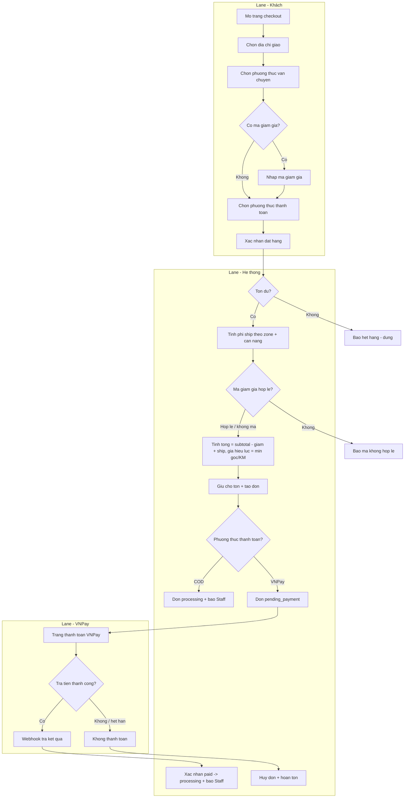
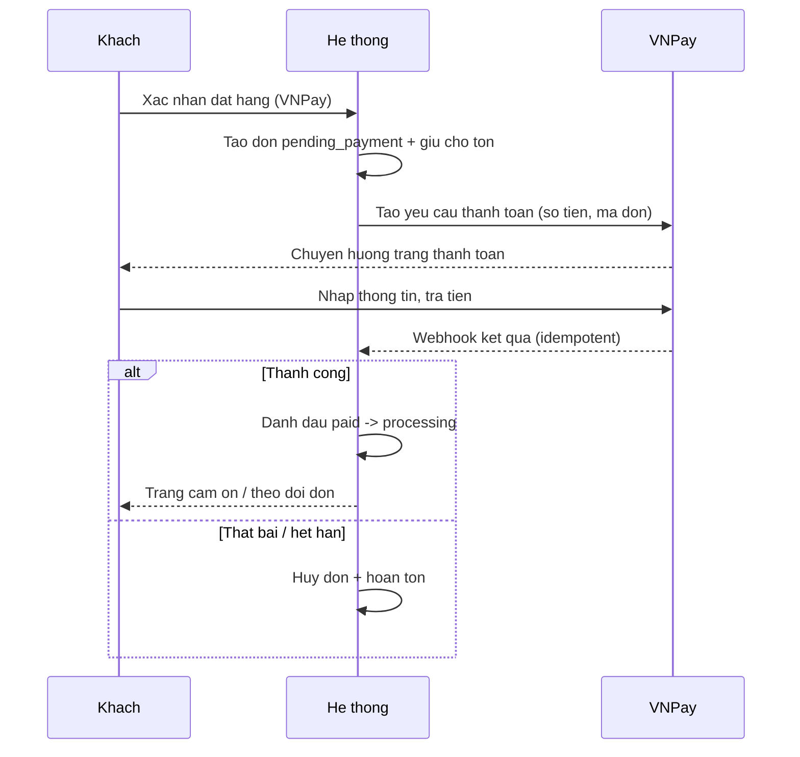
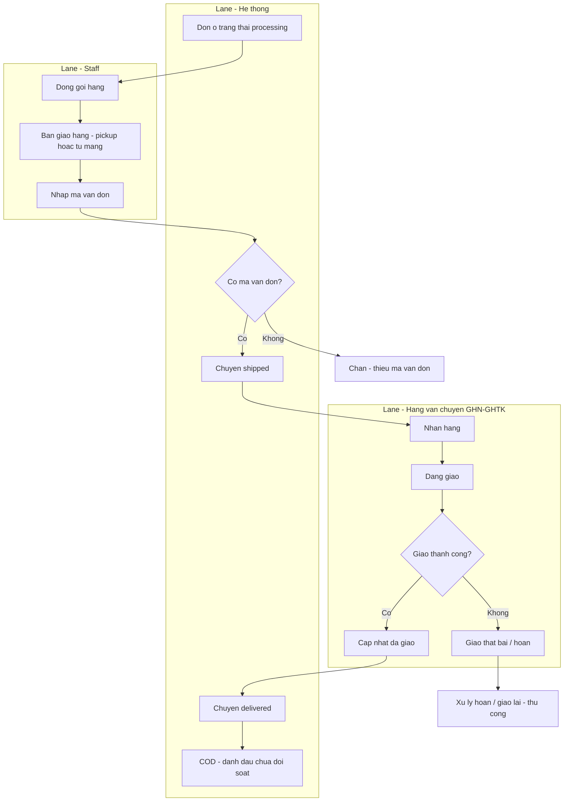
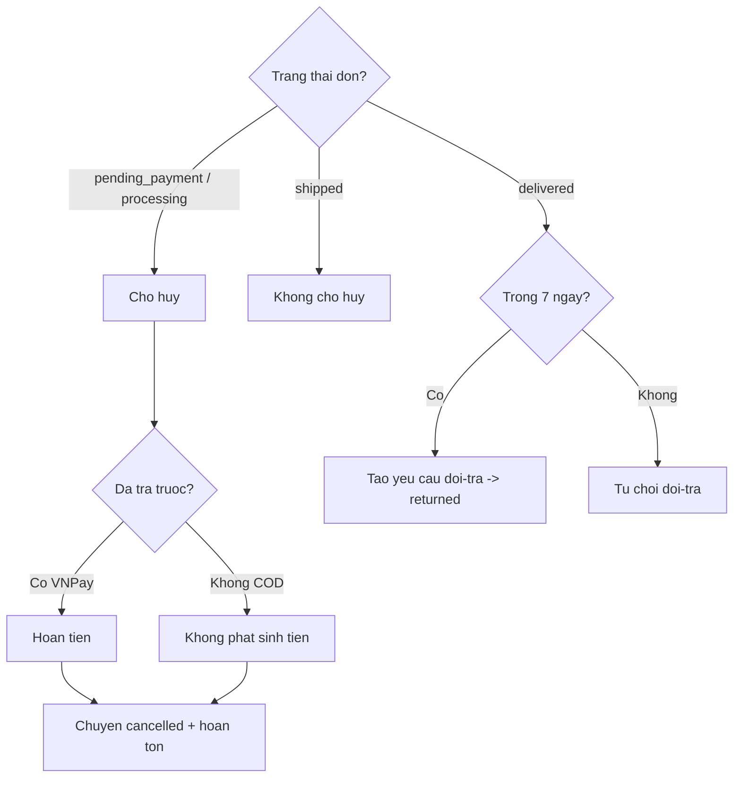
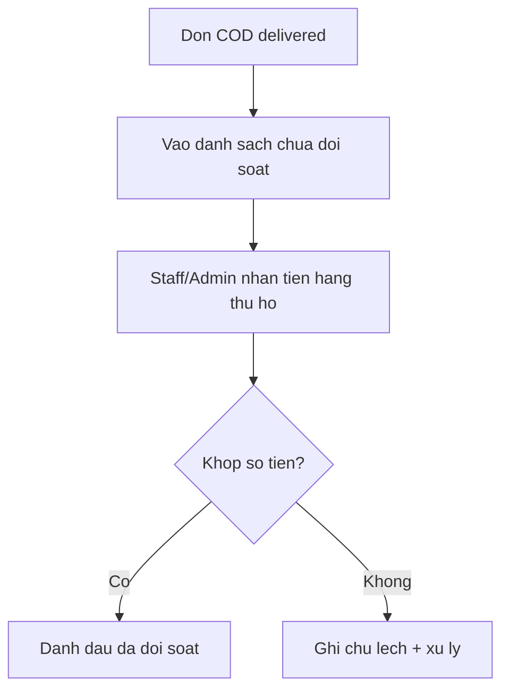

# 11 — BPMN chi tiết: Đặt hàng / Checkout & Fulfillment (MVP)

**Ngày:** 2026-07-17 · **Liên quan:** `04-order-process-and-lifecycle.md`, `10-mvp-srs-and-design.md`
**Ký hiệu:** khối chữ nhật = hành động; khối thoi `{}` = cổng quyết định; các `subgraph` = **làn (lane/actor)**; mũi tên cắt làn = bàn giao giữa actor.

---

## 1. Luồng Đặt hàng & Checkout (end-to-end)

### Bảng bước & cổng (checkout)
| Bước | Actor | Mô tả | Rule |
|---|---|---|---|
| A1–A7 | Khách | Nhập địa chỉ, chọn ship, mã giảm, phương thức, xác nhận | — |
| B1 | Hệ thống | **Kiểm tra tồn** trước khi tạo đơn | BR-02 |
| B2 | Hệ thống | Tính phí ship theo **zone + cân nặng** | FR-06, cần weight |
| B3 | Hệ thống | Validate **mã giảm giá** (hạn dùng, trần) | BR-08 |
| B4 | Hệ thống | Tổng = subtotal − giảm + ship; **giá hiệu lực = min(gốc, KM)** | BR-01 |
| B5 | Hệ thống | **Giữ chỗ tồn** + tạo đơn | BR-02 |
| B6 | Hệ thống | Rẽ nhánh theo phương thức | BR-03 |
| B7 | Hệ thống | **COD → processing ngay** | BR-03 |
| B8→C→B9 | Hệ thống/VNPay | **VNPay → pending_payment → paid → processing** | BR-03 |
| B10 | Hệ thống | VNPay hết hạn/huỷ → **cancelled + hoàn tồn** | BR-05 |

### Ngoại lệ
- **Hết tồn giữa lúc đặt (race):** update tồn có điều kiện `stock ≥ qty`; 0 dòng ảnh hưởng → báo hết hàng (chống oversell).
- **Mã giảm giá hết hạn/hết lượt:** chặn, giữ nguyên giỏ.
- **VNPay timeout:** giải phóng chỗ giữ tồn sau thời hạn.

---

## 2. Tương tác thanh toán VNPay (sequence)

---

## 3. Fulfillment (xử lý đơn → giao)

| Bước | Actor | Rule |
|---|---|---|
| S1–S3 | Staff | Đóng gói, bàn giao **tuỳ lúc** (pickup/tự mang), **nhập mã vận đơn** | 
| D1/D2 | Hệ thống | **shipped bắt buộc mã vận đơn** — BR-04 |
| P4→D3 | Hãng/Hệ thống | Hãng báo giao xong → **delivered** |
| D4 | Hệ thống | COD → đưa vào danh sách **chưa đối soát** — BR-11 |

---

## 4. Huỷ & Đổi-trả

| Nhánh | Rule |
|---|---|
| Huỷ trước ship | BR-05 (chỉ khi chưa shipped; hoàn tiền nếu đã trả) |
| Đổi-trả sau giao | BR-06 (trong **7 ngày**) |

---

## 5. Đối soát COD

---

## 6. Ánh xạ Business Rule (tổng hợp)
- **BR-01** giá hiệu lực · **BR-02** giữ chỗ/chống oversell · **BR-03** COD/VNPay → processing · **BR-04** ship cần mã · **BR-05** huỷ/hoàn · **BR-06** đổi-trả 7 ngày · **BR-08** mã giảm giá ràng buộc · **BR-11** đối soát COD. (Chi tiết ở `10`.)

## 7. Điểm tích hợp (integration touchpoints)
- **VNPay**: tạo yêu cầu thanh toán + **webhook idempotent** xác nhận `paid` (Should).
- **GHN/GHTK**: tạo vận đơn + **tracking webhook** cập nhật `delivered` (Should; MVP đầu nhập mã tay).
- **Cloudinary**: ảnh sản phẩm (đã tích hợp).
